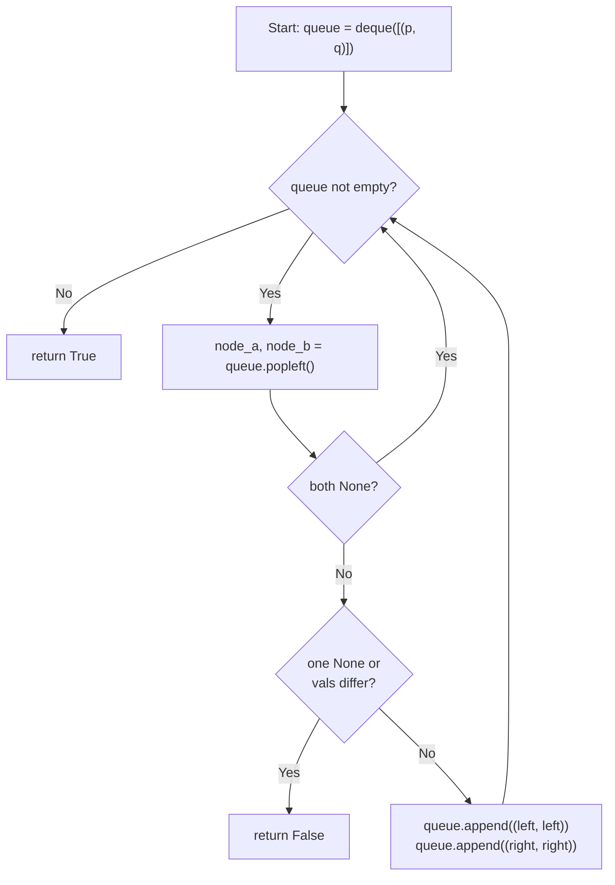

## Data Structures

**Inputs:**

* **`p: Optional[TreeNode]`**: root of the first binary tree.
* **`q: Optional[TreeNode]`**: root of the second binary tree.

**Auxiliary Variables:**

* **`queue: deque[tuple[TreeNode, TreeNode]]`**: BFS queue holding pairs of nodes `(node_a, node_b)` to compare in lockstep.
* **`node_a, node_b`**: the current pair of nodes dequeued for comparison.

## Overall Approach

We perform a **level-order (BFS) traversal** of both trees simultaneously, comparing corresponding nodes at each step:

1. **Initialize the queue**

    ```python
    queue = deque([(p, q)])
    ```

    Seed the BFS with the two root nodes paired together.

2. **Process pairs**

    Pop a pair `(node_a, node_b)` from the front of the queue.

* If **both are `None`**, this branch matches—skip to the next pair.
* If **exactly one is `None`**, or their **values differ**, the trees are not the same—return `False`.

3. **Enqueue children**

    ```python
    queue.append((node_a.left, node_b.left))
    queue.append((node_a.right, node_b.right))
    ```

    Push both left children and both right children as new pairs. `None` children are enqueued and handled in step 2.

4. **Return result**

    If the queue empties without finding a mismatch, every corresponding node matched—return `True`.



## Step-by-Step Walkthrough

1. **`Start`**: Create the BFS queue with the initial pair `(p, q)`.
2. **`Loop`**: While there are pairs to process:
* **`Pop`**: Dequeue the next pair `(node_a, node_b)`.
* **`BothNone`**: If both nodes are `None`, this subtree pair is trivially equal—`continue` to the next pair.
* **`Mismatch`**: If only one is `None`, or `node_a.val != node_b.val`, the trees diverge—return `False` immediately.
* **`Enqueue`**: Otherwise the nodes match. Push their left children as a pair and their right children as a pair.
3. **`RetTrue`**: Queue exhausted with no mismatch found—the trees are identical.

## Complexity Analysis

* **Time:** $O(n)$

    Each node in the smaller tree is visited exactly once. In the worst case (identical trees), all $n$ nodes are compared, giving linear time.

* **Space:** $O(n)$

    The queue can hold up to $O(n)$ node pairs. For a complete binary tree, the widest level contains roughly $n/2$ nodes, so the queue peaks at $O(n)$ entries.
