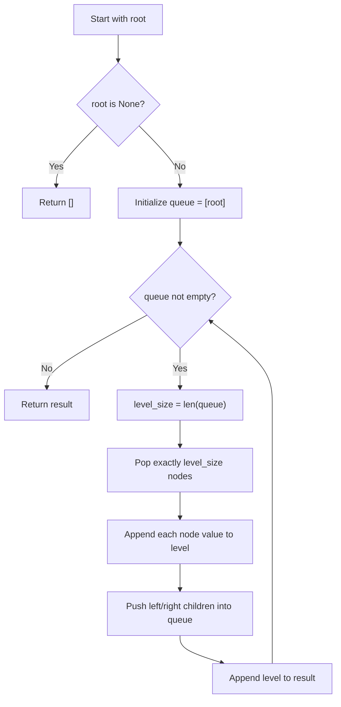

## Data Structures

* **`queue`**: a `deque` used to process tree nodes in FIFO order.
* **`result`**: a list of lists that stores the node values level by level.
* **`level_size`**: the number of nodes currently in the queue, which defines one tree level.
* **`level`**: a temporary list collecting all values from the current level.

## Overall Approach

The solution performs a **breadth-first traversal** of the binary tree. Instead of exploring one branch all the way down, it processes all nodes on the same depth before moving to the next depth.



1. If the tree is empty, return an empty list immediately.
2. Put the root into a queue.
3. For each iteration of the outer loop, record the current queue length.
4. Pop exactly that many nodes to process one level.
5. Append each node's children to the queue so they will be processed in the next round.

## Complexity Analysis

* **Time Complexity**: `O(n)`, where `n` is the number of nodes in the tree.
* **Space Complexity**: `O(w)`, where `w` is the maximum width of the tree. In the worst case, this is `O(n)`.

## Key Insights

* The queue naturally preserves the left-to-right order within each level.
* Measuring `len(queue)` before processing a level is what separates one layer from the next.
* Each node is enqueued and dequeued exactly once.

## Source Code Analysis

```python
from collections import deque
from typing import Optional, List


# Definition for a binary tree node.
class TreeNode:
    def __init__(self, val=0, left=None, right=None):
        self.val = val
        self.left = left
        self.right = right


class Solution:
    def levelOrder(self, root: Optional[TreeNode]) -> List[List[int]]:
        if not root:
            return []

        result = []
        queue = deque([root])

        while queue:
            level_size = len(queue)
            level = []

            for _ in range(level_size):
                node = queue.popleft()
                level.append(node.val)

                if node.left:
                    queue.append(node.left)
                if node.right:
                    queue.append(node.right)

            result.append(level)

        return result
```

## Related Problems

* Binary Tree Right Side View
* Average of Levels in Binary Tree
* Zigzag Level Order Traversal
