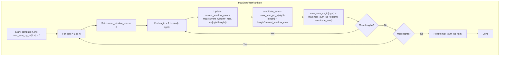

## Data Structures

**Inputs:**  

- `arr`: list of integers of length `n`.  
- `k`: maximum allowed size of each partition (integer).

**Auxiliary Variables:**

- `n`: integer, length of `arr` (`n = len(arr)`).  
- `max_sum_up_to`: list of length `n+1`, where  
- `max_sum_up_to[i]` = the best possible sum for the prefix `arr[0..i-1]` after partition‑and‑replace.

**Loop indices and temporaries:**  

- `right`: integer from 1 to `n`, representing the endpoint (exclusive) of the current prefix.  
- `length`: size of the last partition ending at index `right-1`, ranging from 1 to `min(k, right)`.  
- `current_window_max`: maximum value seen in the current window of size `length`.  
- `candidate_sum`: sum if we choose a partition of size `length` ending at `right-1`.

## What happens in `maxSumAfterPartition`?

We build up the optimum by DP: for each prefix ending at position `right-1`, we consider all possible last‑partition lengths `length ≤ k`, compute the replacement sum for that partition, and add it to the best sum for the prefix before the partition.



I. **Initialization**  

```python
n = len(arr)
max_sum_up_to = [0] * (n + 1)
```
We treat `max_sum_up_to[0]=0` as the empty‑array base case.

II. **Iterate prefixes**  

For each `right` in `1…n`, we compute the best sum for the prefix ending at index `right-1`.

III. **Try all partition lengths**  

Within that, for each possible `length` from `1` up to `min(k, right)`, consider the subarray  

```
arr[right-length : right]
```

as the final partition.

III.A. **Update window max**

```python
current_window_max = max(current_window_max, arr[right - length])
```

III.B. **Compute candidate**  

If we replace the last `length` elements by `current_window_max` each, its contribution is  

```
length * current_window_max
```

and adding the best sum before that partition gives  

```python
candidate_sum = max_sum_up_to[right - length] + length * current_window_max
```

III.C. **Record best**

```python
max_sum_up_to[right] = max(max_sum_up_to[right], candidate_sum)
```

IV. **Result**  

After processing all prefixes, the answer for the entire array is  
```python
return max_sum_up_to[n]
```

## Example

```python
arr = [1, 15, 7, 9, 2, 5, 10]
k = 3
```

We’ll sketch key steps:

**right = 1** (`[1]`):

- length=1 → window_max=1 → sum = $0 + 1×1 = 1$  
→ `max_sum_up_to[1] = 1`

**right = 2** (`[1,15]`):

- length=1 → window_max=15 → sum = $1 + 1×15 = 16$
- length=2 → window_max=15 → sum = $0 + 2×15 = 30$
→ `max_sum_up_to[2] = 30`

**right = 3** (`[1,15,7]`):

- length=1 → window_max=7  → sum = $30 + 7 = 37$
- length=2 → window_max=15 → sum = $1 + 2×15 = 31$
- length=3 → window_max=15 → sum = $0 + 3×15 = 45$
→ `max_sum_up_to[3] = 45`

**right = 4** (`[1,15,7,9]`):

- length=1 → wm=9  → sum = $45 + 9  = 54$
- length=2 → wm=9  → sum = $30 + 2×9 = 48$
- length=3 → wm=15 → sum = $1  + 3×15 = 46$
→ `max_sum_up_to[4] = 54`

… and so on, ultimately yielding **84** for the full array.

## Complexity

**Time:**  

- Outer loop over `right`: $O(n)$ iterations.  
- Inner loop over `length`: up to `k` per iteration.  
- **Overall:** $O(n × k)$.

**Space:**

- $O(n)$ for the `max_sum_up_to` array.
