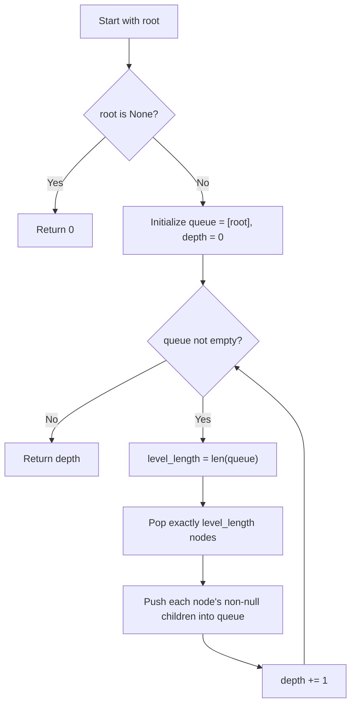

## Data Structures

* **`queue`**: a `deque` used to process tree nodes level by level in FIFO order.
* **`depth`**: integer counter tracking how many levels have been fully processed.
* **`level_length`**: the number of nodes in the queue at the start of each iteration, defining one complete tree level.

## Overall Approach

The solution finds the maximum depth of a binary tree using **breadth-first search (BFS)**. It processes the tree one level at a time, incrementing a depth counter after each level is exhausted. When the queue is empty, every level has been visited and `depth` equals the tree's height.

A commented-out recursive approach is also shown in the source: it returns `max(1 + maxDepth(left), 1 + maxDepth(right))`, computing depth via DFS. The active implementation uses iterative BFS instead.



1. **Base case** — if the tree is empty, return `0` immediately.
   ```python
   if not root:
       return 0
   ```
2. **Initialize** the queue with the root node and set `depth = 0`.
   ```python
   queue = deque([root])
   depth = 0
   ```
3. **Process one level per iteration.** Capture the current queue length to know exactly how many nodes belong to this level.
   ```python
   level_length = len(queue)
   ```
4. **Drain the level.** Pop `level_length` nodes, enqueueing each node's left and right children if they exist.
   ```python
   for _ in range(level_length):
       node = queue.popleft()
       if node.left:
           queue.append(node.left)
       if node.right:
           queue.append(node.right)
   ```
5. **Increment depth** after the entire level has been processed.
   ```python
   depth += 1
   ```
6. **Return `depth`** once the queue is empty — all levels have been counted.

## Complexity Analysis

* **Time Complexity**: $O(n)$, where `n` is the number of nodes in the tree. Every node is enqueued and dequeued exactly once.
* **Space Complexity**: $O(w)$, where `w` is the maximum width of the tree (the largest number of nodes on any single level). In the worst case of a complete binary tree this is $O(n/2)$ = $O(n)$.

## Key Insights

* Measuring `len(queue)` before processing a level is the mechanism that separates one depth layer from the next.
* BFS naturally counts depth by exhausting entire levels, making it a direct fit for this problem.
* The recursive DFS alternative achieves the same $O(n)$ time and $O(h)$ space (where `h` is the tree height), but is susceptible to stack overflow on deeply skewed trees.
