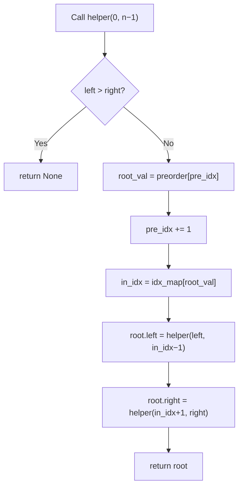

## Data Structures

Input:

**`preorder`**  
- List of node values in preorder (root → left → right).

**`inorder`**  
- List of node values in inorder (left → root → right).

Auxiliary:

**`idx_map`**  
- A dictionary mapping each value in `inorder` to its index.  
- Allows O(1) lookup of the root’s position in the inorder sequence.

**`self.pre_idx`**  
- An integer pointer into `preorder`, indicating the next root to process.

## What happens in `buildTree()`?



1. **Build index map**  
   ```python
   idx_map = {val: i for i, val in enumerate(inorder)}
   ```
2. **Initialize**  
   ```python
   self.pre_idx = 0
   ```
3. **Recursive helper(left, right)**  
   - **Base case:** if `left > right`, no nodes remain → return `None`.  
   - **Root selection:**  
     ```python
     root_val = preorder[self.pre_idx]
     root = TreeNode(root_val)
     self.pre_idx += 1
     ```  
   - **Split inorder:**  
     ```python
     in_idx = idx_map[root_val]
     ```  
   - **Recurse left:** `helper(left, in_idx - 1)`  
   - **Recurse right:** `helper(in_idx + 1, right)`  
   - **Return** the constructed `root`.

## Complexity

- **Time:** O(n)  
  Each of the n nodes is created once, and lookups in `idx_map` are O(1).

- **Space:** O(n)  
  - The `idx_map` uses O(n) extra space.  
  - Recursion stack may go O(n) deep in the worst (skewed) tree.
