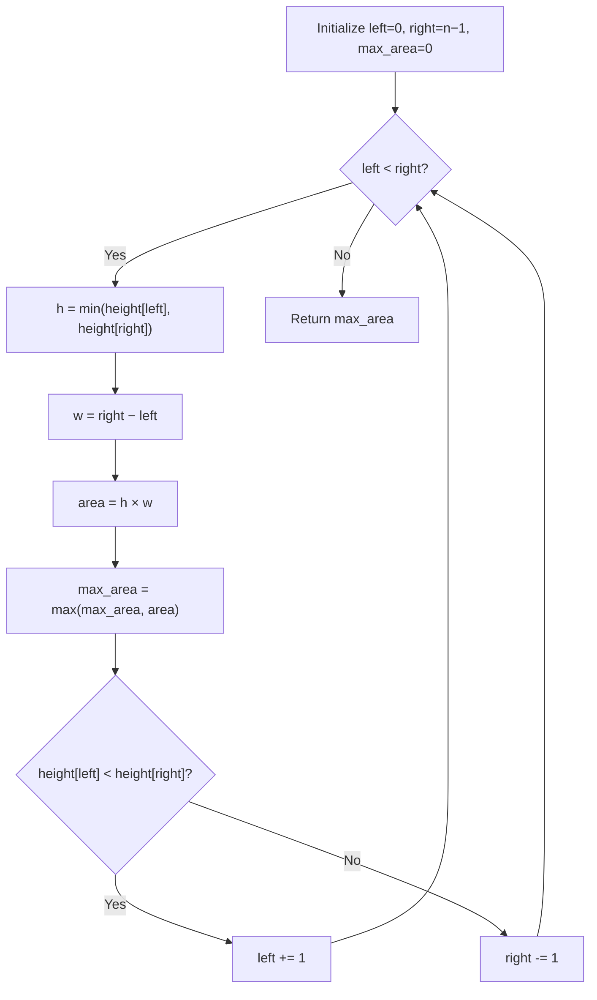

## Data Structures

**`height`**  
- A list of integers where `height[i]` is the height of the vertical line at x-coordinate `i`.

**`left`, `right`**  
- Two integer pointers into `height`:  
  - `left` starts at `0`.  
  - `right` starts at `len(height) - 1`.

**`max_area`**  
- An integer tracking the largest container area seen so far.

## What happens in `maxArea()`?



1. **Initialization**  
   ```python
   left, right = 0, len(height) - 1
   max_area = 0
   ```

2. **Two‐pointer loop**  
   - While `left < right`:
     1. **Compute water height**  
        `h = min(height[left], height[right])`  
     2. **Compute width**  
        `w = right - left`  
     3. **Compute area**  
        `area = h * w`  
     4. **Update max**  
        ```python
        max_area = max(max_area, area)
        ```  
     5. **Advance pointer**  
        Move the pointer at the shorter line inward:
        ```python
        if height[left] < height[right]:
            left += 1
        else:
            right -= 1
        ```

3. **Return result**  
   When `left` meets `right`, `max_area` holds the maximum possible area.

## Complexity

- **Time:** O(n), each pointer moves inward at most n steps.  
- **Space:** O(1), only a fixed number of variables are used.
