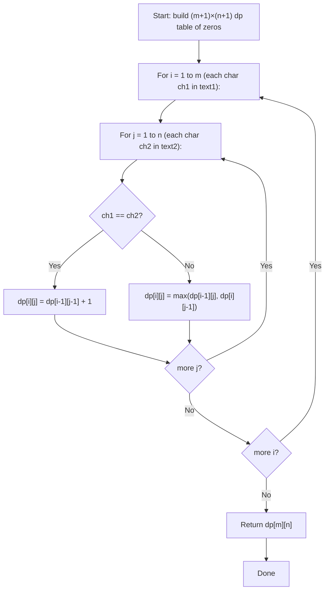

## Data Structures

**Inputs:**

* `text1`: first string of length $m$.
* `text2`: second string of length $n$.

**Auxiliary Variables:**

* `dp`: 2-D array of size $(m+1) \times (n+1)$, where

  $$
    dp[i][j] = \text{length of the longest common subsequence of } \texttt{text1[0..i-1]} \text{ and } \texttt{text2[0..j-1]},
  $$

  with the entire zeroth row and zeroth column initialized to $0$ (empty-string base cases).

* `row`: reference to `dp[i]`, the current row being filled.
* `prev_row`: reference to `dp[i-1]`, the row for the previous character of `text1`.

## Overall Approach

We use **bottom-up dynamic programming** on two string prefixes. For every pair of characters `text1[i-1]` and `text2[j-1]`, if they match we extend the LCS of the two shorter prefixes by one; otherwise we take the better of dropping one character from either string.



### I. Initialization

```python
m, n = len(text1), len(text2)
dp = [[0] * (n + 1) for _ in range(m + 1)]
```

The zeroth row (`dp[0][...]`) and zeroth column (`dp[...][0]`) are all zero, representing comparisons against an empty string.

### II. Fill the Table

For each `i` from $1$ to $m$ and each `j` from $1$ to $n$, we store references to the current and previous rows for cleaner access:

```python
row = dp[i]
prev_row = dp[i - 1]
```

### III. Recurrence Relation

For each character pair `ch1 = text1[i-1]` and `ch2 = text2[j-1]`:

III.A. **Characters match**

```python
if ch1 == ch2:
    row[j] = prev_row[j - 1] + 1
```

The matched character extends the LCS of the two prefixes that exclude it: $dp[i][j] = dp[i-1][j-1] + 1$.

III.B. **Characters differ**

```python
else:
    row[j] = max(prev_row[j], row[j - 1])
```

We cannot use both characters, so we take the better of skipping one from either string: $dp[i][j] = \max(dp[i-1][j],\; dp[i][j-1])$.

### IV. Result

After processing all prefix pairs, the answer for the full strings is:

```python
return dp[m][n]
```

## Example

```python
text1 = "abcde"
text2 = "ace"
```

The filled DP table:

|       |  ""  |  a  |  c  |  e  |
| :---: | :--: | :-: | :-: | :-: |
| **""**  |  0   |  0  |  0  |  0  |
| **a**   |  0   |  1  |  1  |  1  |
| **b**   |  0   |  1  |  1  |  1  |
| **c**   |  0   |  1  |  2  |  2  |
| **d**   |  0   |  1  |  2  |  2  |
| **e**   |  0   |  1  |  2  |  3  |

* At $(1,1)$: `a == a` → $dp[0][0]+1 = 1$.
* At $(3,2)$: `c == c` → $dp[2][1]+1 = 2$.
* At $(5,3)$: `e == e` → $dp[4][2]+1 = 3$.

Result: $dp[5][3] = 3$ — the LCS is `"ace"`.

## Complexity

* **Time:**
  Two nested loops of sizes $m$ and $n$, each doing $O(1)$ work.

  $$
    O(m \times n).
  $$

* **Space:**

  $$
    O(m \times n)
  $$

  for the `dp` table.
