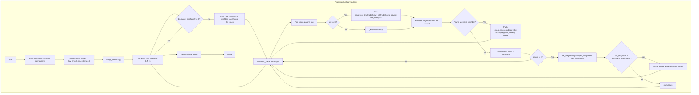

## Data Structures

**Inputs:**  
- `server_count` (`N`): integer number of nodes (servers), labeled `0…N−1`.  
- `connections`: list of undirected edges `[u, v]`.

**Auxiliary Structures:**  
- `adjacency_list: List[List[int]]` of length `N`, where `adjacency_list[u]` lists all neighbors of `u`.  
- `discovery_time: List[int]` of length `N`, initialized to `-1`, recording the DFS visitation timestamp of each node.  
- `low_link: List[int]` of length `N`, where `low_link[u]` is the smallest discovery time reachable from `u` via any path (including back‑edges).  
- `time_stamp: int`, a global counter incremented on each node visit.  
- `bridge_edges: List[List[int]]`, the output list of all critical connections (bridges).  
- `dfs_stack: List[Tuple[int, int, int]]`, an explicit stack for iterative DFS.  
  - Each frame is `(node, parent, next_neighbor_index)`.

---

## What happens in `criticalConnections`

We run a **Tarjan‑style bridge‑finding** via an **iterative DFS**. As we explore, we assign each node a discovery time and maintain its low‑link. Whenever we finish processing a child subtree and find `low_link[child] > discovery_time[parent]`, the edge is a bridge.



---

### Step‑by‑step

1. **Build adjacency list**  
   ```python
   adjacency_list = [[] for _ in range(N)]
   for u, v in connections:
       adjacency_list[u].append(v)
       adjacency_list[v].append(u)
   ```

2. **Initialize arrays**  
   ```python
   discovery_time = [-1]*N
   low_link       = [0]*N
   time_stamp     = 0
   bridge_edges   = []
   dfs_stack      = []
   ```

3. **Iterate components**  
   For each node `start` from `0` to `N−1`:
   - If already visited (`discovery_time[start] != -1`), skip.
   - Otherwise, push `(start, parent=-1, next_neighbor_index=0)` to `dfs_stack`.

4. **Iterative DFS**  
   While the stack isn’t empty:
   - Pop `(node, parent, idx)`.
   - **First time** at this node (`idx == 0`):  
     ```python
     discovery_time[node] = low_link[node] = time_stamp
     time_stamp += 1
     ```
   - **Process neighbors** starting from `idx`:  
     - If a neighbor `w` has `discovery_time[w] == -1` (tree edge):  
       1. Push `(node, parent, next_idx)` back on stack to resume later.  
       2. Push `(w, node, 0)` to explore `w`.  
       3. **Break** to dive deeper.
     - Else if `w != parent` (back edge):  
       ```python
       low_link[node] = min(low_link[node], discovery_time[w])
       ```
     - Continue scanning until all neighbors are done.
   - **Backtracking** (no more neighbors):  
     - If `parent != -1`, update its low‑link:  
       ```python
       low_link[parent] = min(low_link[parent], low_link[node])
       ```
     - If `low_link[node] > discovery_time[parent]`, the edge `(parent,node)` is a **bridge**; record it.

5. **Return**  
   ```python
   return bridge_edges
   ```

---

## Example

```
N = 5
connections = [[0,1],[1,2],[2,0],[1,3],[3,4]]
```

- The cycle `0–1–2–0` has no bridges.  
- Edges `(1,3)` and `(3,4)` are bridges.

Running the algorithm yields `[[3,4],[1,3]]` (order may vary).

---

## Complexity

- **Time:**  
  - Building adjacency list: O(N + E).  
  - Each node is pushed and popped once; each edge is examined twice.  
  - Overall **O(N + E)**.

- **Space:**  
  - **O(N + E)** for the adjacency list and **O(N)** for the stacks and arrays.
