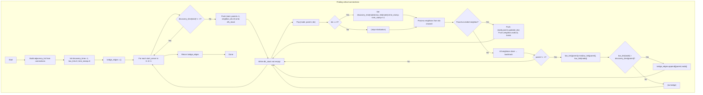

## Data Structures

**Inputs:**  
- `server_count` (`N`): integer number of nodes (servers), labeled `0…N−1`.  
- `connections`: list of undirected edges `[u, v]`.

**Auxiliary Structures:**  
- `adjacency_list: List[List[int]]` of length `N`, where `adjacency_list[u]` lists all neighbors of `u`.  
- `discovery_time: List[int]` of length `N`, initialized to `-1`, recording the DFS visitation timestamp of each node.  
- `low_link: List[int]` of length `N`, where `low_link[u]` is the smallest discovery time reachable from `u` via any path (including back‑edges).  
- `time_stamp: int`, a global counter incremented on each node visit.  
- `bridge_edges: List[List[int]]`, the output list of all critical connections (bridges).  
- `dfs_stack: List[Tuple[int, int, int]]`, an explicit stack for iterative DFS.  
- Each frame is `(node, parent, next_neighbor_index)`.

## What happens in `criticalConnections`

We run a **Tarjan‑style bridge‑finding** via an **iterative DFS**. As we explore, we assign each node a discovery time and maintain its low‑link. Whenever we finish processing a child subtree and find `low_link[child] > discovery_time[parent]`, the edge is a bridge.


```mermaid
flowchart TD
  subgraph bridges["Finding critical connections"]
    A["Start"] --> B["Build adjacency_list from connections"]
    B --> C["Init discovery_time=-1, low_link=0, time_stamp=0"]
    C --> D["bridge_edges = []"]
    D --> E["For each start_server in 0..N−1:"]
    E --> F{"discovery_time[start] != -1?"}
    F -->|Yes| E
    F -->|No| G["Push (start, parent=-1, neighbor_idx=0) onto dfs_stack"]
    G --> H["While dfs_stack not empty:"]
    H --> I["Pop (node, parent, idx)"]
    I --> J{"idx == 0?"}
    J -->|Yes| K["Set discovery_time[node]=low_link[node]=time_stamp; time_stamp+=1"]
    J -->|No| L["(skip initialization)"]
    K --> M
    L --> M
    M["Process neighbors from idx onward:"] --> N{"Found unvisited neighbor?"}
    N -->|Yes| O["Push (node,parent,updated_idx);\nPush (neighbor,node,0); break"]
    N -->|No| P["All neighbors done → backtrack"]
    O --> H
    P --> Q{"parent != -1?"}
    Q -->|Yes| R["low_link[parent]=min(low_link[parent], low_link[node])"]
    R --> S{"low_link[node] > discovery_time[parent]?"}
    S -->|Yes| T["bridge_edges.append([parent,node])"]
    S -->|No| U["(no bridge)"]
    T --> H
    U --> H
    Q -->|No| H
    H --> E
    E --> V["Return bridge_edges"]
    V --> W["Done"]
  end
```

### Step‑by‑step

Step 1: Build the adjacency list

We convert the list of edges into a structure that makes traversal easy.
Each node keeps a list of its neighbors.

```
adjacency_list = [[] for _ in range(N)]
for u, v in connections:
    adjacency_list[u].append(v)
    adjacency_list[v].append(u)
```

This works because the graph is undirected, so every edge goes both ways.

Step 2: Initialize helper variables

We prepare arrays to track the DFS process.

`discovery_time = [-1] * N` stores when each node is first visited.
`low_link = [0] * N` stores the earliest reachable discovery time.
`time_stamp = 0` is a global counter.
`bridge_edges = []` will store the result.
`dfs_stack = []` simulates recursion

Step 3: Iterate through all nodes

We loop through every node to ensure disconnected components are also handled.

For each node, if it has already been visited (its discovery time is not -1), we skip it.
Otherwise, we start a DFS from that node.

`dfs_stack.append((start, -1, 0))`

Each stack entry contains:
node, its parent, and the index of the next neighbor to explore.

Step 4: Iterative DFS process

We process nodes using the stack until it becomes empty.

When we first visit a node (its neighbor index is 0), we assign its discovery time and initialize its low-link value.

```
discovery_time[node] = time_stamp
low_link[node] = time_stamp
time_stamp += 1
```

Then we explore its neighbors.

If we find an unvisited neighbor, it is a tree edge.
We pause the current node and go deeper:

```
dfs_stack.append((node, parent, next_idx))
dfs_stack.append((neighbor, node, 0))
```

If we find a visited neighbor that is not the parent, it is a back edge.
We update the low-link value:

`low_link[node] = min(low_link[node], discovery_time[neighbor])`

If all neighbors are processed, we backtrack.

When backtracking, we update the parent’s low-link value:

`low_link[parent] = min(low_link[parent], low_link[node])`

Then we check if the edge is a bridge:

```
if low_link[node] > discovery_time[parent]:
    bridge_edges.append((parent, node))
```

This condition means the subtree rooted at this node cannot reach any earlier node without using this edge.

Step 5: Return result

After finishing DFS for all components, we return:

`return bridge_edges`

The core idea is simple:
low-link values tell us how far back a node (or its subtree) can reach.
If it cannot reach above its parent, then the edge to the parent is a bridge.

## Example

```
N = 5
connections = [[0,1],[1,2],[2,0],[1,3],[3,4]]
```

- The cycle `0–1–2–0` has no bridges.  
- Edges `(1,3)` and `(3,4)` are bridges.

Running the algorithm yields `[[3,4],[1,3]]` (order may vary).

## Complexity

- **Time:**  
- Building adjacency list: $O(N + E)$.  
- Each node is pushed and popped once; each edge is examined twice.  
- Overall $O(N + E)$.

- **Space:**  
- $O(N + E)$ for the adjacency list and $O(N)$ for the stacks and arrays.
