## Data Structures

**Input lists**  
- `startTime`, `endTime`, `profit`: each of length `n_jobs`.  
  - `startTime[i]`, `endTime[i]`, `profit[i]` describe job _i_.

**`jobs_sorted`**  
- A list of tuples `(start, end, profit)` for each job, **sorted by** `end` ascending.  
- Allows us to consider jobs in order of finishing time.

**`sorted_end_times`**  
- A list of just the end times from `jobs_sorted`, in sorted order.  
- Enables binary search (`bisect_right`) to find the last job that doesn’t conflict.

**`max_profit`**  
- A list of length `n_jobs + 1`, where  
  - `max_profit[i]` = maximum profit achievable using the first `i` jobs in `jobs_sorted`.  
- We use **1‑based indexing**: `max_profit[0] = 0` (no jobs → zero profit).

---

## What happens in `jobScheduling`?

We perform a **dynamic programming** scan over jobs in order of finish time, deciding for each whether to take it or skip it. To decide efficiently which previous job is compatible, we do a binary search on `sorted_end_times`.

```mermaid
flowchart TD
  subgraph scheduling["Computing max profit"]
    A["Start"] --> B["Pair up and sort jobs by end time"]
    B --> C["Extract sorted_end_times"]
    C --> D["Initialize max_profit array"]
    D --> E["For i in 1..n_jobs:"]
    E --> F["Let current = jobs_sorted[i-1]"]
    F --> G["Find compatible_index = rightmost job ending ≤ current.start"]
    G --> H["Compute skip_profit = max_profit[i-1]"]
    H --> I["Compute take_profit = max_profit[compatible_index] + current.profit"]
    I --> J["max_profit[i] = max(skip_profit, take_profit)"]
    J --> K{"More jobs?"}
    K -->|Yes| E
    K -->|No| L["Return max_profit[n_jobs]"]
    L --> M["Done"]
  end
```



I. **Pair & sort**  
```python
jobs_sorted = sorted(zip(startTime, endTime, profit),
                     key=lambda job: job[1])
```
We get a list of jobs in increasing order of their finish times.

II. **Prepare for binary search**  
```python
sorted_end_times = [end for _, end, _ in jobs_sorted]
```
This lets us, for a given job’s start time, find via `bisect_right` the count of jobs that end no later than that start.

III. **DP array init**  
```python
n_jobs = len(jobs_sorted)
max_profit = [0] * (n_jobs + 1)
```
We’ll fill `max_profit[1]…max_profit[n_jobs]`.

IV. **Iterate jobs**  
For each `i` from `1` to `n_jobs`:
1. Unpack the _i_th sorted job:  
   ```python
   curr_start, curr_end, curr_profit = jobs_sorted[i-1]
   ```
2. **Find compatible**:  
   ```python
   compatible_index = bisect_right(sorted_end_times, curr_start)
   ```
   Gives the number of jobs ending ≤ `curr_start`.
3. **Decide**:  
   - **Skip** → `skip_profit = max_profit[i-1]`  
   - **Take** → `take_profit = max_profit[compatible_index] + curr_profit`
4. **Record best**:  
   ```python
   max_profit[i] = max(skip_profit, take_profit)
   ```

V. **Result**  
After the loop, `max_profit[n_jobs]` is the overall maximum achievable profit.

---

## Example

```python
startTime = [1, 2, 4, 6]
endTime   = [3, 5, 6, 7]
profit    = [20,20,100,200]
```

1. **Pair & sort by end**  
   ```
   jobs_sorted = [
     (1,3,20),
     (2,5,20),
     (4,6,100),
     (6,7,200)
   ]
   sorted_end_times = [3,5,6,7]
   ```

2. **DP init**  
   ```
   max_profit = [0, 0, 0, 0, 0]  # indices 0..4
   ```

3. **i = 1** (job (1,3,20))  
   - `compatible_index = bisect_right([3,5,6,7], 1) = 0`  
   - skip = `max_profit[0] = 0`  
   - take = `max_profit[0] + 20 = 20`  
   → `max_profit[1] = 20`

4. **i = 2** (job (2,5,20))  
   - `compatible_index = bisect_right(..., 2) = 0`  
   - skip = `max_profit[1] = 20`  
   - take = `0 + 20 = 20`  
   → `max_profit[2] = 20`

5. **i = 3** (job (4,6,100))  
   - `compatible_index = bisect_right(..., 4) = 2`  (jobs ending at 3 and 5 are ≤ 4? Actually only 3 ≤ 4 → index 1, but bisect_right returns insertion point, giving 1; check: `[3,5,6,7]`, 4 inserts at pos 1 → so compatible_index=1)  
   - skip = `max_profit[2] = 20`  
   - take = `max_profit[1] + 100 = 120`  
   → `max_profit[3] = 120`

6. **i = 4** (job (6,7,200))  
   - `compatible_index = bisect_right(..., 6) = 3`  (end ≤ 6 are 3,5,6 → 3 jobs)  
   - skip = `max_profit[3] = 120`  
   - take = `max_profit[3] + 200 = 320`  
   → `max_profit[4] = 320`

**Answer:** `max_profit[4] = 320`

---

## Complexity

- **Time:**  
  - Sorting jobs: O(n log n).  
  - Building `sorted_end_times`: O(n).  
  - DP loop: n iterations, each doing a binary search O(log n) → O(n log n).  
  - **Overall:** O(n log n).

- **Space:**  
  - O(n) for `jobs_sorted`, `sorted_end_times`, and `max_profit`.
