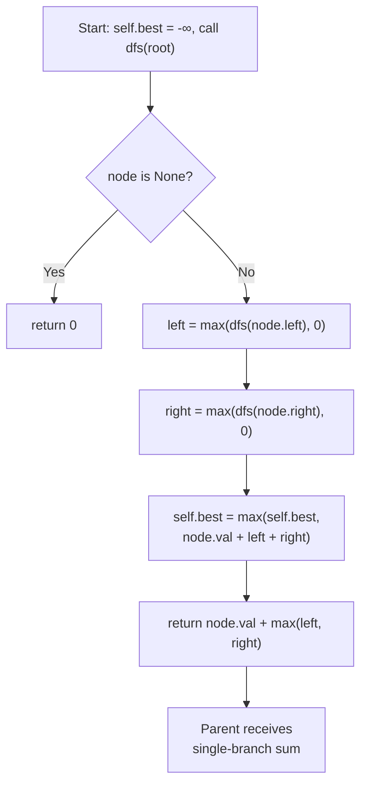

## Data Structures

**Inputs:**

* **`root: Optional[TreeNode]`**: root of the binary tree. Node values can be negative.

**Auxiliary Variables:**

* **`self.best`**: global maximum path sum found so far, initialized to $-\infty$ so that any single node improves it.
* **`left`**: the maximum sum obtainable from the left subtree as a single downward path, clamped to $0$ (we ignore the subtree if it would reduce the sum).
* **`right`**: the maximum sum obtainable from the right subtree as a single downward path, also clamped to $0$.

## Overall Approach

We use a **post-order DFS** where each recursive call serves two purposes:

1. **Update the global answer** — the best path *through* the current node uses both children: `node.val + left + right`.
2. **Return to the parent** — a path can only extend upward through one branch, so we return `node.val + max(left, right)`.

Clamping subtree contributions to $0$ with `max(..., 0)` means we never extend into a subtree that would decrease the total.



## Step-by-Step Walkthrough

1. **Initialize the global best**

    ```python
    self.best = -math.inf
    ```

    Start with negative infinity so that even a tree of all-negative values produces a valid answer.

2. **Base case — null node**

    ```python
    if not node:
        return 0
    ```

    A `None` child contributes nothing.

3. **Recurse into children and clamp**

    ```python
    left = max(dfs(node.left), 0)
    right = max(dfs(node.right), 0)
    ```

    Compute each subtree's best downward path. If a subtree's contribution is negative, treat it as $0$ — we simply skip that branch.

4. **Update the global maximum**

    ```python
    self.best = max(self.best, node.val + left + right)
    ```

    The path `left ← node → right` passes through the current node using both branches. This is the only place where both sides are combined, because a valid path cannot fork further up.

5. **Return single-branch sum to the parent**

    ```python
    return node.val + max(left, right)
    ```

    The parent can only extend the path through one child, so return the better of the two branches plus the current node's value.

6. **Final result**

    ```python
    dfs(root)
    return self.best
    ```

    After the DFS completes, `self.best` holds the maximum path sum across all possible paths in the tree.

## Complexity Analysis

* **Time:** $O(n)$

    Every node is visited exactly once during the post-order DFS, and each visit does $O(1)$ work.

* **Space:** $O(h)$

    The recursion stack grows to the height of the tree $h$. In the worst case (skewed tree) $h = n$, giving $O(n)$. For a balanced tree, $h = \log n$.
