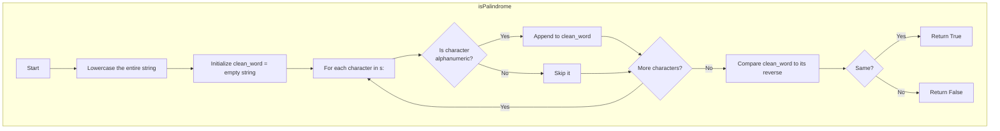

## Data Structures

**`s`**  
- The input string, which may contain uppercase letters, lowercase letters, digits, and non‑alphanumeric characters (spaces, punctuation, etc.).

**`clean_word`**  
- A string built by iterating through `s` after lowercasing it, keeping only alphanumeric characters.
- This is the sanitized version of the input we actually check for palindrome properties.

---

## What happens in `isPalindrome`?

We normalize the string by lowercasing and stripping non‑alphanumeric characters, then check whether the cleaned result reads the same forwards and backwards.



I. **Lowercase the input**

```python
s = s.lower()
```

Converts the entire string to lowercase so comparisons are case‑insensitive.

II. **Strip non‑alphanumeric characters**

```python
clean_word = ""

for ch in s:
    if ch.isalnum():
        clean_word += ch
```

Walk through every character. If it's a letter or digit, append it to `clean_word`; otherwise discard it. After this loop, `clean_word` contains only the characters that matter.

For example, `"A man, a plan, a canal: Panama"` becomes `"amanaplanacanalpanama"`.

III. **Compare against reverse**

```python
return clean_word == ''.join(reversed(clean_word))
```

`reversed(clean_word)` produces the characters in reverse order; `''.join(...)` reassembles them into a string. If it matches `clean_word`, the input is a valid palindrome.

---

## Example

```python
s = "A man, a plan, a canal: Panama"
```

**Step 1 — Lowercase:**

```
"a man, a plan, a canal: panama"
```

**Step 2 — Filter alphanumeric:**

```
a m a n a p l a n a c a n a l p a n a m a
↓
"amanaplanacanalpanama"
```

**Step 3 — Reverse and compare:**

```
clean_word:  "amanaplanacanalpanama"
reversed:    "amanaplanacanalpanama"
             ✓ identical → return True
```

---

## Complexity

**Time:** $O(n)$  
- Lowercasing the string is $O(n)$.  
- The filtering loop visits each character once: $O(n)$.  
- Reversing and joining is $O(n)$, and the equality check is $O(n)$.  
- **Overall:** $O(n)$, where $n$ is the length of the input string.

**Space:** $O(n)$  
- `clean_word` stores up to $n$ characters.  
- The reversed copy also takes $O(n)$.
