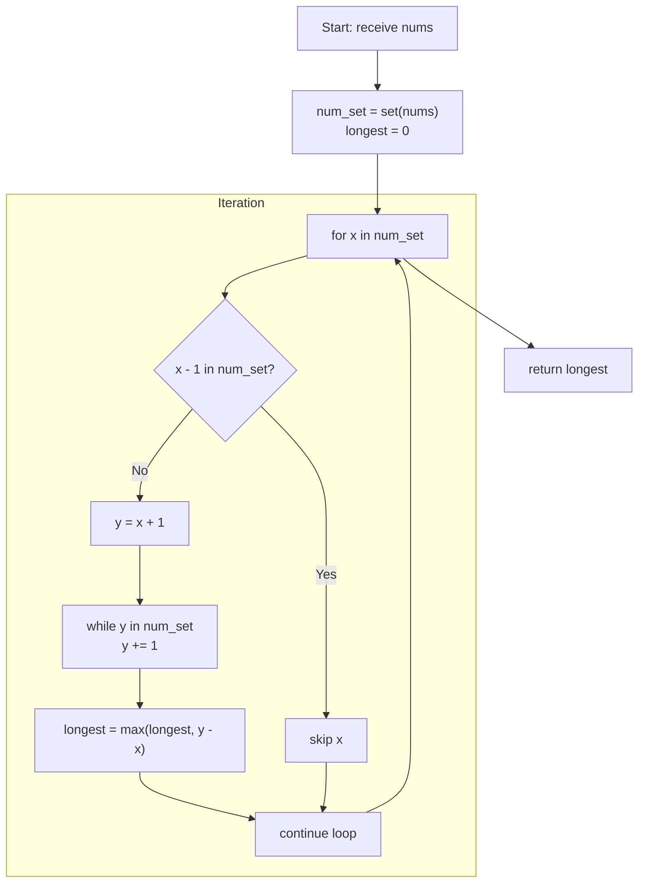

## Data Structures

* **`nums: List[int]`**
  The input list of integers (unsorted).

* **`num_set: Set[int]`**
  A hash set containing all elements of `nums`, used for O(1) lookups.

* **`longest: int`**
  Tracks the length of the longest consecutive sequence found so far.

* **`x: int`**
  Iterates over each unique number in `num_set`.

* **`y: int`**
  Used to “walk” forward from a starting element `x`, checking `x+1, x+2, …` in `num_set` until the streak breaks.

## Overall Approach

We leverage a hash set to achieve an O(n)-time solution by only exploring sequences from their minimal starting point:

1. **Build the set**

   ```python
   num_set = set(nums)
   longest = 0
   ```

   Converting `nums` into `num_set` takes O(n) time and lets us test membership in O(1).

2. **Find sequence starts**
   Loop through each unique value `x` in `num_set`.

   * If `x - 1` is *not* in `num_set`, then `x` must be the beginning of a consecutive run (because no smaller neighbor precedes it).
   * Otherwise, skip it—its sequence will be (or has been) counted when we started from a smaller value.

3. **Walk the run**

   ```python
   if x - 1 not in num_set:
       y = x + 1
       while y in num_set:
           y += 1
       # Now [x … y - 1] is one consecutive run.
       longest = max(longest, y - x)
   ```

   Once we identify a start `x`, increment `y` until it no longer appears in `num_set`.

   * The length of this run is `(y - x)` because it covers all integers from `x` up to `y−1`.
   * Update `longest` if this run is longer than any previously seen run.

4. **Return result**
   After examining every `x`, `longest` holds the maximum consecutive-sequence length. Return it.

## Step-By-Step Flowchart



1. **`BuildSet`**: Construct `num_set` and initialize `longest = 0`.
2. **`LoopX`**: For each element `x` in `num_set`:

   * **`IsStart`**: Check if `(x - 1)` exists in `num_set`.

     * If **yes**, skip this `x` because its sequence will be counted from a lower start.
     * If **no**, proceed to **`InitY`**.
3. **`InitY`**: Set `y = x + 1`.
4. **`Walk`**: Increment `y` while it remains in `num_set`. When it exits the set, the run is `[x, x+1, …, y-1]`.
5. **`Update`**: Compute the run length as `(y - x)` and update `longest`.
6. Continue until all `x` are processed, then **`End`** returns the final `longest`.

## Complexity

* **Time:** \$O(n)\$

  * Building `num_set` from `nums` costs \$O(n)\$.
  * Each element is inserted once, and each is visited at most twice:

    1. Once when checking if it’s a “start” (`x - 1 not in num_set`),
    2. At most once while “walking” a run (every element in a run is checked by `while y in num_set`).
       Thus, overall linear in the number of input elements.

* **Space:** \$O(n)\$

  * The `num_set` holds up to all elements of `nums`.
  * All other variables (`longest`, `x`, `y`) use constant extra space.
