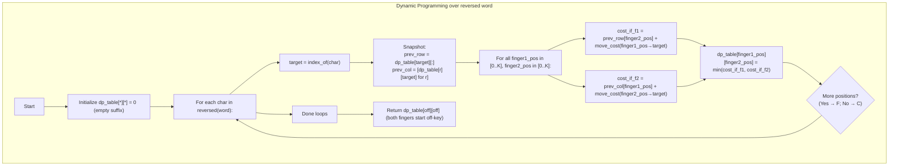

## Data Structures

**Keyboard layout**  
- `_key_positions: Dict[str, Tuple[int,int]]`  
  Maps each letter to its row‐and‐column on a custom keyboard (rows of 6 keys, last row “Y Z”).  

- `_keys: List[str]`  
  A sorted list of all letter keys (`["A","B",…,"Z"]`).  

- `_off_key_index: int`  
  The index representing “finger is off the keyboard” (one past the last real key index).  

- `_key_to_index: Dict[Optional[str],int]`  
  Maps each letter (and `None`) to a numeric index in `[0…len(_keys)]`.  

- `_distance_matrix: List[List[int]]`  
  A precomputed `len(_keys)×len(_keys)` matrix of Manhattan distances between all pairs of keys.  

**DP table**  
- `dp_table: List[List[int]]` of size `(K+1)×(K+1)`, where `K = len(_keys)`.  
  - `dp_table[f1][f2]` = minimum additional cost to type the **remaining** suffix when finger1 is on key index `f1` and finger2 is on key index `f2`.  
  - Index `K` in either dimension means that finger is “off” the keyboard (no cost to bring it on first use).

---

## What happens in `minimumDistance(word)`?

We fill `dp_table` by iterating **backwards** through the target word so that, at each step, we know the cost to finish typing the rest of the letters.



1. **Initialization**  
   - Create a `(K+1)×(K+1)` table of zeros.  
   - `dp_table[f1][f2]` will represent the _cost to finish_ once you’ve typed all characters _after_ the current one, given finger1 at `f1` and finger2 at `f2`.

2. **Process each character in reverse**  
   - **`target`** = the numeric index of the current character.  
   - **Snapshot** the current `dp_table` values in row `target` and column `target` so we don’t overwrite them mid‑compute.

3. **Transition** for every possible `(finger1_pos, finger2_pos)`:  
   - **Option A**: move **finger 1** to `target`  
     ```
     cost_if_f1 = prev_row[finger2_pos] 
                  + move_cost(finger1_pos → target)
     ```
   - **Option B**: move **finger 2** to `target`  
     ```
     cost_if_f2 = prev_col[finger1_pos] 
                  + move_cost(finger2_pos → target)
     ```
   - Pick the cheaper of the two.

4. **Final answer**  
   After processing all characters, both fingers start “off” the keyboard, so the result is
   ```python
   return dp_table[off_index][off_index]
   ```

---

## Example

Consider **word = "CAB"** on our 6‑column keyboard:

- Positions:  
  - `C` at (0,2)  
  - `A` at (0,0)  
  - `B` at (0,1)  

**Intuition**:  
1. **Type “C”**: move a finger from off → C costs **0**.  
2. **Type “A”**: move the other finger off → A costs **0**.  
3. **Type “B”**: best to move the finger at “A” over to “B” (distance |0–1| = **1**).  

Total minimum movement = **1**.

Indeed, the DP returns **1**.

---

## Complexity

- **Time:**  
  - Let `n = len(word)`, `K = 26` (number of keys).  
  - For each of the `n` characters, we do a double loop over `(K+1)×(K+1)` states → O(n·K²).  
  - Since `K` is constant (26 letters), this is effectively **O(n)**.

- **Space:**  
  - The DP table is size **(K+1)²**, i.e. **O(1)** with respect to `n` (constant auxiliary space).
