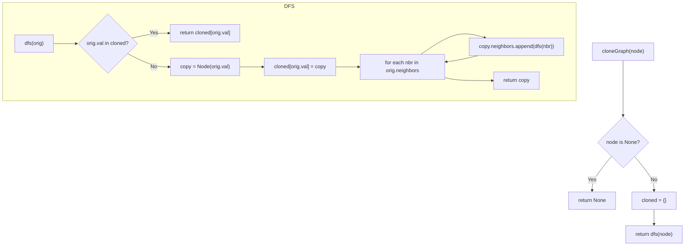

## Data Structures

**`node`**  
- The entry point into the original graph (or `None` if empty).

**`cloned: Dict[int, Node]`**  
- Maps each original node’s unique `val` → its cloned `Node`.  
- Using the integer `val` as key (rather than the object) speeds up dictionary lookups slightly.

## Why DFS (recursive) is optimal here

1. **O(N+E) time & O(N) space**  
   - Every node is visited exactly once, and every edge is traversed exactly once.  
   - The cloning map and the recursion stack together use O(N) extra space.  

2. **Lower overhead than BFS**  
   - No `deque` operations—just direct recursive calls.  
   - Local variable lookups (`cloned` and the nested `dfs`) are faster than repeated queue enqueues/dequeues.

3. **Good locality**  
   - Recursion follows pointers directly, often touching data that’s already in cache.  
   - BFS jumps around the graph in “rings,” which can incur more pointer-chasing.

4. **Safe recursion depth**  
   - Constraints limit the graph to ≤100 nodes, so recursion depth (≤100) is well under Python’s default limit.

## What happens step-by-step

1. **Start** with the given `node`.  
2. **Base case:** if it’s `None`, return `None`.  
3. **Initialize** an empty `cloned` map.  
4. **DFS**:  
   - If we see a node’s `val` in `cloned`, we’ve already built its clone → return it (handles cycles).  
   - Otherwise, make a new `Node(val)`, register it, then recurse on each neighbor, appending clones to its `neighbors` list.  
5. **Return** the clone corresponding to the original entry node.
