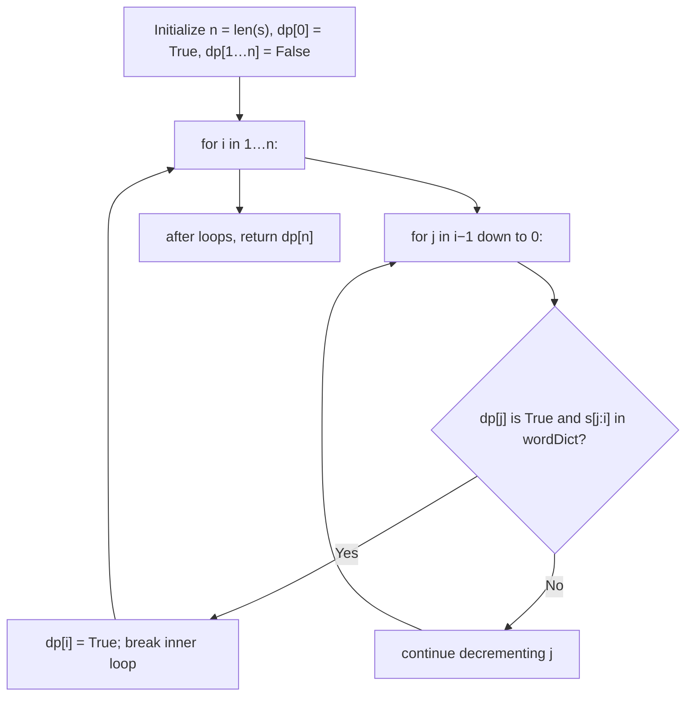

## Data Structures

**`s`**

* Input string of length `n`.

**`wordDict`**

* List of valid words.
* Internally used as a set membership test for `O(1)` lookups (convert if needed).

**`n`**

* Integer equal to `len(s)`.

**`dp`**

* Boolean list of length `n+1`:

  * `dp[i] == True` means `s[0:i]` (the first `i` characters) can be segmented into words from `wordDict`.
  * Initialized as

    ```python
    dp = [True] + [False] * n
    ```

    so that `dp[0] = True` (empty string is “segmented”).

---

## What happens in `wordBreak()`



1. **Initialization**

   ```python
   n = len(s)
   dp = [True] + [False] * n
   word_set = set(wordDict)   # optional for faster lookup
   ```

   * `dp[0] = True` because an empty prefix is trivially segmented.
   * All other `dp[i]` start as `False`.

2. **Populate DP array**

   ```python
   for i in range(1, n+1):            # consider prefixes of length i
       for j in range(i-1, -1, -1):   # split point between j and i
           if dp[j] and s[j:i] in word_set:
               dp[i] = True
               break                 # no need to check smaller j
   ```

   * **Outer loop (`i`)** iterates over all prefix lengths.
   * **Inner loop (`j`)** tries every possible last word `s[j:i]`.
   * If the prefix up to `j` is segmentable (`dp[j] == True`) **and** the suffix `s[j:i]` is a word, mark `dp[i] = True` and stop checking shorter suffixes.

3. **Return result**

   ```python
   return dp[n]
   ```

   * If `dp[n]` is `True`, the entire string `s` can be segmented; otherwise, it cannot.

---

## Complexity

* **Time:**

  * Outer loop runs `n` times.
  * Inner loop scans up to `n` splits each time, and substring lookup is $O(k)$ for substring creation plus $O(1)$ for hash lookup (with `word_set`).
  * **Overall:** roughly $O(n^2 \times k)$, where $k$ is average word length.

* **Space:**

  * $O(n)$ for the `dp` array.
  * $O(m)$ for the `word_set`, where $m$ is total dictionary size.
