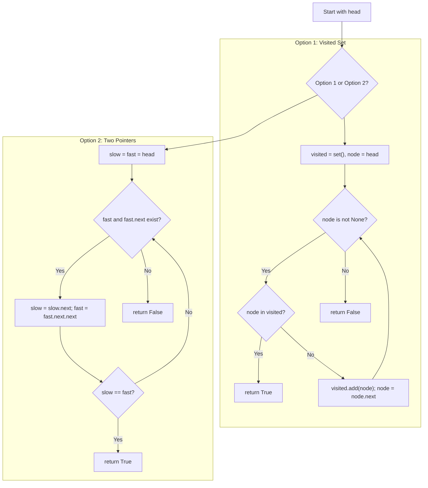

## Data Structures

**`head`**

* A `ListNode` or `None`, representing the start of the singly-linked list.

**Option 1: `visited`**

* A `set` of `ListNode` objects we have already seen as we traverse.

**Option 2: `slow`, `fast`**

* Two pointers into the list:

  * `slow` moves one node at a time.
  * `fast` moves two nodes at a time.

---

## What happens in `hasCycle()`



1. **Option 1: Using a `visited` set**

   * Initialize an empty set and start `node = head`.
   * Traverse the list:

     1. If `node` is already in `visited`, a cycle exists → **return `True`**.
     2. Otherwise, add `node` to `visited` and move to `node.next`.
   * If you reach `None`, no cycle → **return `False`**.

2. **Option 2: Floyd’s Tortoise and Hare**

   1. **Initialization**

      ```python
      slow = fast = head
      ```
   2. **Traverse with two pointers**

      * While both `fast` and `fast.next` are not `None`:

        * Move `slow` one step:

          ```python
          slow = slow.next
          ```
        * Move `fast` two steps:

          ```python
          fast = fast.next.next
          ```
        * If at any point `slow == fast`, they’ve met inside a cycle → **return `True`**.
   3. **No meeting point**

      * If the loop exits (i.e., `fast` or `fast.next` is `None`), the list terminates → **return `False`**.

---

## Complexity

| Approach         | Time Complexity | Space Complexity |
| ---------------- | --------------- | ---------------- |
| **Visited Set**  | O(n)            | O(n)             |
| **Two Pointers** | O(n)            | O(1)             |
