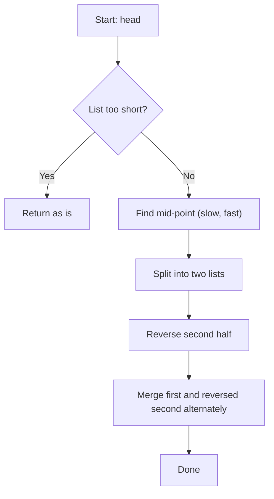

## Data Structures

**`ListNode`**

* A node in a singly-linked list with attributes:

  * `val`: the integer value stored in the node.
  * `next`: a reference to the next `ListNode` (or `None`).

**`head`**

* A `ListNode` pointer to the start of the list.

**`slow`, `fast`**

* Two pointers used to find the midpoint of the list:

  * `slow` moves one step at a time.
  * `fast` moves two steps at a time.

**`prev`, `curr`, `nxt`**

* Temporary pointers used during the in-place reversal of the second half:

  * `curr`: the node currently being processed.
  * `prev`: the head of the partially reversed list.
  * `nxt`: stores `curr.next` before re-linking.

**`first`, `second`**

* Pointers used to merge the two halves:

  * `first` traverses the first (front) half.
  * `second` traverses the reversed second half.

## What happens in `reorderList()`



1. **Base case check**

   ```python
   if head is None or head.next is None or head.next.next is None:
       return
   ```

   * If the list has fewer than 3 nodes, there's nothing to reorder.

2. **Find the midpoint**

   ```python
   slow, fast = head, head
   while fast and fast.next:
       slow = slow.next
       fast = fast.next.next
   ```

   * After the loop, `slow` points to the midpoint (end of first half).

3. **Split the list**

   ```python
   second = slow.next
   slow.next = None
   ```

   * Detach the second half starting from `second`.

4. **Reverse the second half**

   ```python
   prev = None
   curr = second
   while curr:
       nxt = curr.next
       curr.next = prev
       prev = curr
       curr = nxt
   ```

   * Standard in-place reversal: `prev` becomes head of the reversed second list.

5. **Merge the two halves**

   ```python
   first = head
   second = prev
   while second:
       tmp_first = first.next
       tmp_second = second.next

       first.next = second
       second.next = tmp_first

       first = tmp_first
       second = tmp_second
   ```

   * Alternately weave nodes from `first` and `second` lists until all from the second half are merged.

## Complexity

* **Time:** O(n)

  * Finding midpoint: O(n)
  * Reversing second half: O(n/2)
  * Merging halves: O(n)

* **Space:** O(1)

  * All operations are done in-place with a fixed number of pointers.
