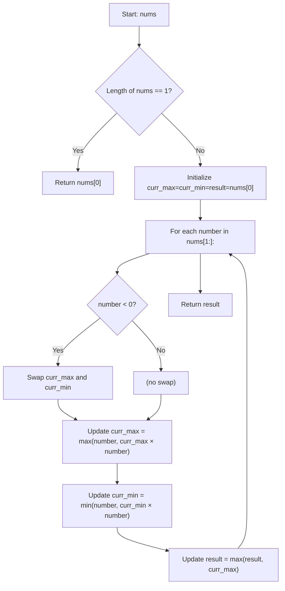

## Data Structures

**`nums`**

* A list of integers (can include positive, negative, and zero).

**`curr_max`**, **`curr_min`**

* Integers tracking, at each position, the maximum and minimum products that end at the current element.
* We need both because a negative number can turn a large positive product into a large negative one and vice versa.

**`result`**

* Integer tracking the overall maximum product seen so far.

---

## What happens in `maxProduct()`



1. **Handle trivial case**

   ```python
   if len(nums) == 1:
       return nums[0]
   ```

   * If there is only one element, that element is the max product.

2. **Initialization**

   ```python
   curr_max = nums[0]
   curr_min = nums[0]
   result   = nums[0]
   ```

   * All three start at the first element.

3. **Iterate through the rest**

   ```python
   for number in nums[1:]:
   ```

   * For each new **number**, we want the maximum product of any subarray ending at that index.

4. **Swap on negative**

   ```python
   if number < 0:
       curr_max, curr_min = curr_min, curr_max
   ```

   * A negative flips signs, so the current minimum could become the maximum when multiplied by a negative.

5. **Update running max and min**

   ```python
   curr_max = max(number, curr_max * number)
   curr_min = min(number, curr_min * number)
   ```

   * **curr\_max** becomes either the current number alone (start new subarray) or extend the previous max subarray.
   * **curr\_min** similarly tracks the smallest product, which may become max later.

6. **Track global result**

   ```python
   result = max(result, curr_max)
   ```

   * Compare the current running maximum to the best seen so far.

7. **Return**

   ```python
   return result
   ```

   * After scanning all numbers, **result** holds the maximum product of any contiguous subarray.

---

## Complexity

* **Time:** O(n), where n = length of **nums**.

  * Single pass through the list.

* **Space:** O(1)

  * Only a fixed number of variables are used.
