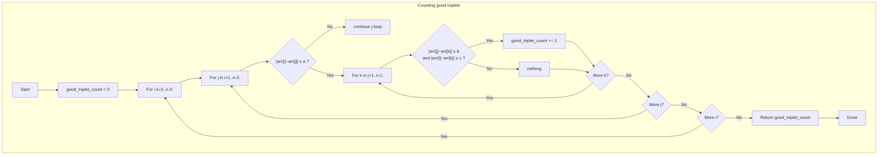

## Data Structures

**Inputs:**  
- `arr`: list of integers of length `n`.  
- `a`, `b`, `c`: integer thresholds.

**Auxiliary Variables:**  
- `n`: integer, the length of `arr` (`n = len(arr)`).  
- `good_triplet_count`: integer counter, initialized to `0`, storing how many “good” triplets we’ve found.

---

## What happens in `countGoodTriplets`?

We simply **enumerate** every triple of indices `(i, j, k)` with `i < j < k`, test the three distance conditions, and count those that satisfy all.



I. **Initialize Counter**  
```python
good_triplet_count = 0
```

II. **First Loop (`i`)**  
Iterate `i` from `0` to `n−3`.

III. **Second Loop (`j`)**  
For each `i`, iterate `j` from `i+1` to `n−2`.  
- **Early pruning**: if  
  ```python
  abs(arr[i] - arr[j]) > a
  ```  
  then no need to try any `k` for this `(i,j)`.

IV. **Third Loop (`k`)**  
For each `(i,j)` that passes pruning, iterate `k` from `j+1` to `n−1`.  
- Check both remaining conditions:  
  ```python
  abs(arr[j] - arr[k]) <= b
  abs(arr[i] - arr[k]) <= c
  ```  
- If **both** hold, increment the counter:
  ```python
  good_triplet_count += 1
  ```

V. **Return**  
After all loops finish:
```python
return good_triplet_count
```

---

## Example

```python
arr = [3, 0, 1, 1, 9, 7]
a, b, c = 7, 2, 3
```

All triples `(i, j, k)` with `i<j<k` are:

- `(0,1,2)`: values `(3,0,1)`  
  - |3−0|=3 ≤7; |0−1|=1 ≤2; |3−1|=2 ≤3 → **good**

- `(0,1,3)`: `(3,0,1)` same distances → **good**

- `(0,1,4)`: `(3,0,9)` → |0−9|=9 >2 → bad

- `(0,2,3)`: `(3,1,1)` → |3−1|=2 ≤7; |1−1|=0 ≤2; |3−1|=2 ≤3 → **good**

- `(0,3,5)`: `(3,1,7)` → |1−7|=6 >2 → bad

- `(1,2,3)`: `(0,1,1)` → distances ≤ thresholds → **good**

…and so on.  In total, there are **4** good triplets.

---

## Complexity

- **Time:**  
  - We have three nested loops in the worst case → O(n³).  
  - The early `continue` after checking the first condition can prune some work but doesn’t change the cubic worst‑case.

- **Space:**  
  - **O(1)** extra space (only counters and loop indices).  
