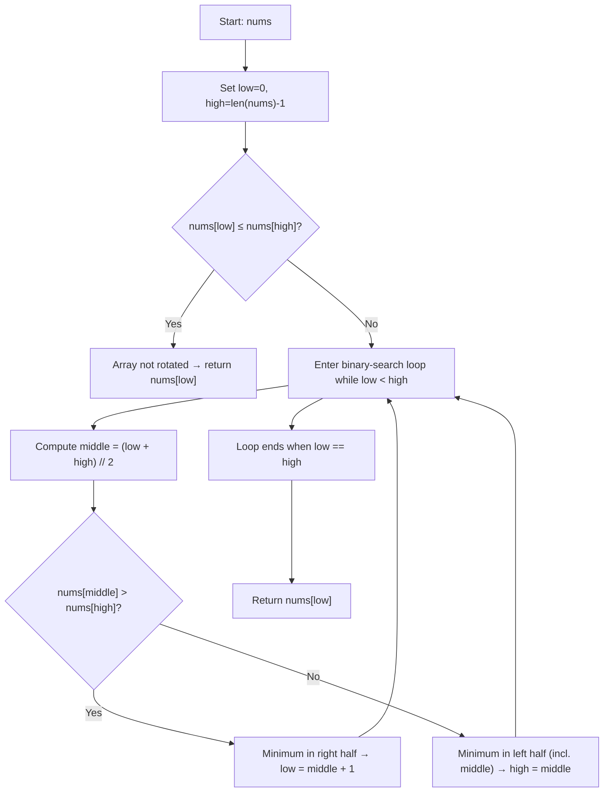

## Data Structures

**`nums`**

* A list of integers representing a sorted array that has been rotated at some pivot.

**`low`, `high`**

* Integer indices bounding the current search range within **nums**.

  * **low** starts at 0.
  * **high** starts at `len(nums) - 1`.

**`middle`**

* Integer index computed as the midpoint of **low** and **high** in each iteration.

---

## What happens in `findMin()`



1. **Initialize pointers**

   ```python
   low, high = 0, len(nums) - 1
   ```

   * Define the search interval across the entire array.

2. **Check for no rotation**

   ```python
   if nums[low] <= nums[high]:
       return nums[low]
   ```

   * If the first element is ≤ the last, the array is already fully sorted and the minimum is at index **low**.

3. **Binary search for pivot**

   ```python
   while low < high:
       middle = (low + high) // 2
       if nums[middle] > nums[high]:
           low = middle + 1
       else:
           high = middle
   ```

   * Compute **middle** of current range.
   * **If** the middle element is greater than the element at **high**, the smallest value lies to the right of **middle**, so shift **low** to `middle + 1`.
   * **Else**, the minimum is at **middle** or to its left, so move **high** to `middle`.
   * Repeat until **low** meets **high**.

4. **Return the minimum**

   ```python
   return nums[low]
   ```

   * At termination, **low == high**, both pointing to the smallest element.

---

## Complexity

* **Time:** O(log n)

  * Each iteration halves the search interval.

* **Space:** O(1)

  * Only a fixed number of index variables are used.
