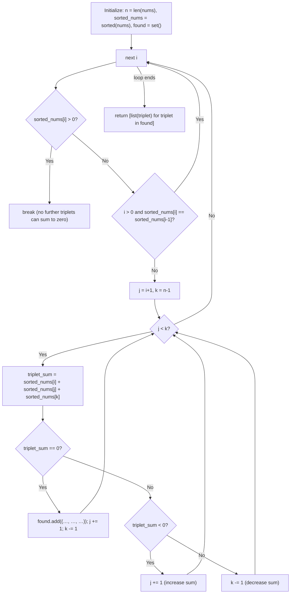

## Data Structures

**`nums`**

* The input list of integers.

**`n`**

* An integer holding the length of `nums`.

**`sorted_nums`**

* A new list containing the elements of `nums` in non-decreasing order.

**`found`**

* A set of tuples, each tuple representing a unique triplet $(a,b,c)$ whose sum is zero.
* Using a set ensures duplicate triplets are discarded automatically.

**`i`, `j`, `k`**

* Integer indices into `sorted_nums`:

  * `i` iterates from `0` to `n-3` (the first element of the triplet).
  * `j` starts at `i+1` (the second element).
  * `k` starts at `n-1` (the third element).

**`triplet_sum`**

* Temporary integer storing `sorted_nums[i] + sorted_nums[j] + sorted_nums[k]`.

---

## What happens in `threeSum()`?



1. **Initialization**

   ```python
   n = len(nums)
   sorted_nums = sorted(nums)
   found = set()
   ```

   * Sorts the input for two-pointer technique and easy duplicate handling.

2. **Outer loop over `i`**

   ```python
   for i in range(n-2):
   ```

   * We need at least two more elements after `i`, so stop at `n-3`.

3. **Early exit**

   ```python
   if sorted_nums[i] > 0:
       break
   ```

   * Since the array is sorted, once the first element is positive, no further triplet can sum to zero.

4. **Skip duplicates for `i`**

   ```python
   if i > 0 and sorted_nums[i] == sorted_nums[i-1]:
       continue
   ```

   * Avoid repeating work on the same first element.

5. **Two-pointer setup**

   ```python
   j = i + 1
   k = n - 1
   ```

   * `j` scans forward, `k` scans backward to find pairs that complement `sorted_nums[i]`.

6. **Inner while-loop**

   ```python
   while j < k:
       triplet_sum = sorted_nums[i] + sorted_nums[j] + sorted_nums[k]
       if triplet_sum == 0:
           found.add((sorted_nums[i], sorted_nums[j], sorted_nums[k]))
           j += 1
           k -= 1
       elif triplet_sum < 0:
           j += 1
       else:
           k -= 1
   ```

   * **Equal to zero:** record the triplet, then move both pointers inward.
   * **Less than zero:** sum too small ⇒ advance `j` to increase sum.
   * **Greater than zero:** sum too large ⇒ decrement `k` to decrease sum.

7. **Return result**

   ```python
   return [list(triplet) for triplet in found]
   ```

   * Converts each tuple in the set back to a list.

---

## Complexity

* **Time:**

  * Sorting: O(n log n)
  * Two-pointer search for each `i`: O(n) ⇒ Total O(n²)
* **Space:**

  * O(n) for `sorted_nums`
  * Up to O(n²) in the worst case for `found` (if many unique triplets), but typically much less.
