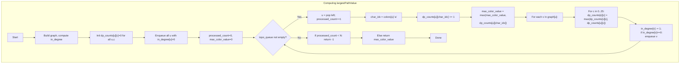

## Data Structures

**Inputs:**  
- `colors`: a string of length `N`, where `colors[i]` is a lowercase letter `'a'…'z'` labeling node _i_.  
- `edges`: list of directed edges `[src, dst]`.

**Auxiliary Structures:**  
- `graph`: adjacency list, `graph[u]` is a list of all `v` with an edge `u → v`.  
- `in_degree`: list of length `N`, where `in_degree[v]` is the number of incoming edges to node _v_.  
- `dp_counts`: an `N×26` matrix of integers, where  
  ```
  dp_counts[u][c] =
    max number of occurrences of color c along any path that ends at u.
  ```  
- `topo_queue`: a queue of nodes with zero in‑degree, for Kahn’s topological sort.  
- `processed_count`: how many nodes we’ve dequeued (to detect cycles).  
- `max_color_value`: the best color‑count seen anywhere, which we’ll return.

---

## What happens in `largestPathValue`

We perform a **topological traversal** of the DAG, carrying along for each node `u` a vector `dp_counts[u]` of the best color‑counts for paths ending at `u`. When visiting `u`, we increment the count for its own color, update our global maximum, then “push” these counts forward to its neighbors by taking pairwise maxima. If we can’t process all nodes (cycle detected), we return `-1`.



### Step-by-step

1. **Build graph & in‑degrees**  
   ```python
   graph = [[] for _ in range(N)]
   in_degree = [0]*N
   for src, dst in edges:
       graph[src].append(dst)
       in_degree[dst] += 1
   ```
2. **Initialize DP counts**  
   ```python
   dp_counts = [[0]*26 for _ in range(N)]
   ```
3. **Queue zero in‑degree**  
   ```python
   from collections import deque
   topo_queue = deque(u for u in range(N) if in_degree[u]==0)
   processed_count = 0
   max_color_value = 0
   ```
4. **Process in topological order**  
   While `topo_queue` not empty:
   - Pop `u`, increment `processed_count`.  
   - Compute its color index:
     ```python
     char_idx = ord(colors[u]) - ord('a')
     dp_counts[u][char_idx] += 1
     max_color_value = max(max_color_value, dp_counts[u][char_idx])
     ```
   - For each neighbor `v` in `graph[u]`, update:
     ```python
     for c in range(26):
         dp_counts[v][c] = max(dp_counts[v][c], dp_counts[u][c])
     in_degree[v] -= 1
     if in_degree[v] == 0:
         topo_queue.append(v)
     ```
5. **Cycle check**  
   If `processed_count < N`, a cycle exists → **return** `-1`.  
   Otherwise, **return** `max_color_value`.

---

## Example

```python
colors = "abaca"
edges  = [[0,1],[0,2],[2,3],[3,4]]
```

- Nodes 0→1, 0→2, 2→3, 3→4  
- Color labels:  
  ```
  0:'a', 1:'b', 2:'a', 3:'c', 4:'a'
  ```

**Topological order** might be `[0,1,2,3,4]`. We track `dp_counts[u]` as vectors of counts for `['a','b','c',…]`:

| Step | u  | Action                                                    | dp_counts[u] (a,b,c) | max_color_value |
|:----:|:--:|:-----------------------------------------------------------|:---------------------|:---------------:|
|  1   | 0  | Start with all zeros; then see 'a': +1 for 'a'            | (1,0,0)              | 1               |
|      |    | Propagate to 1 and 2                                       |                       |                 |
|  2   | 1  | Pops 1; sees 'b': inherits (1,0,0) → +1 at 'b' = (1,1,0)  | (1,1,0)              | 1               |
|  3   | 2  | Pops 2; sees 'a': inherits (1,0,0) → +1 at 'a' = (2,0,0)  | (2,0,0)              | 2               |
|      |    | Propagate to 3                                             |                       |                 |
|  4   | 3  | Pops 3; sees 'c': inherits (2,0,0) → +1 at 'c' = (2,0,1)  | (2,0,1)              | 2               |
|      |    | Propagate to 4                                             |                       |                 |
|  5   | 4  | Pops 4; sees 'a': inherits (2,0,1) → +1 at 'a' = (3,0,1)  | (3,0,1)              | **3**           |

No cycle detected; **answer = 3** (the longest “a”‑chain along path 0→2→3→4).

---

## Complexity

- **Time:**  
  - Building the graph and in‑degree: O(N + E).  
  - Kahn’s loop processes each node once and each edge once. For each edge we do a 26‑length scan → O(26·E) = O(E).  
  - **Total:** O(N + E).

- **Space:**  
  - **O(N + E)** for the adjacency list.  
  - **O(26·N) = O(N)** for the `dp_counts` table.
