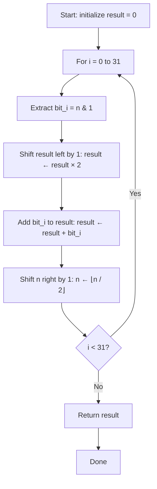

## Data Structures

**Inputs:**

* `n`: a 32-bit unsigned integer whose bits we wish to reverse.

**Auxiliary Variables:**

* `result`: integer accumulator that builds the reversed bit pattern.
* `i`: loop index ranging from 0 to 31.
* `bit_i`: the value of the least significant bit at each iteration (0 or 1).

## What Happens in `reverseBits`?

We treat the 32-bit word as a sequence of bits $b_{31}b_{30}\dots b_1b_0$. The goal is to produce the integer whose binary representation is $b_0b_1\dots b_{30}b_{31}$. Rather than manipulating string representations, we use shifts and bitwise masks.

### I. Initialization

Set

$$
 \text{result} = 0
$$

This will accumulate the reversed bits.

### II. Iterate Over All 32 Bit-Positions

For each iteration $i$ from 0 up to 31:

1. **Extract** the current least significant bit:

$$
\text{bit}_i = n \wedge 1
$$

2. **Shift** the accumulator left by one position (equivalent to multiplying by 2):

$$
\text{result} \leftarrow 2 \times \text{result}
$$

3. **Append** the extracted bit to the low end of `result`:

$$
\text{result} \leftarrow \text{result} + \text{bit}_i
$$

4. **Discard** that bit from `n` by shifting it right one position (integer division by 2):

$$
n \leftarrow \lfloor n / 2\rfloor
$$

After these four sub-steps, one bit of the original integer has been moved to its mirrored position in `result`.

## Example

Reverse the 8-bit pattern for clarity (generalizes to 32 bits identically).

* Let $n = \texttt{0b11010010}$ (binary for $210$).
* We process bits one by one:

| Iteration $i$ | Before (result) | bit\_i | After shift & add                         | n shifts right |
| :-----------: | :-------------: | :----: | :---------------------------------------- | :------------- |
|       0       |     00000000    |    0   | 00000000 → 00000000                       | 01101001       |
|       1       |     00000000    |    1   | 00000000 → 00000001                       | 00110100       |
|       …       |        …        |    …   | …                                         | …              |
|       7       |     00010011    |    1   | 00010011 → 00100111 (final reversed bits) | 00000000       |

* Final `result` = `0b00100111` = 39, which is the bit-reverse of 210 in 8-bit form.

## Mathematical Perspective

Viewing the loop algebraically, after $k$ iterations the accumulator holds

$$
  \sum_{j=0}^{k-1} b_j \;2^{\,k-1-j},
$$

where $b_j$ is the $j$-th least significant bit of the original `n`. After 32 steps, this becomes

$$
  \sum_{j=0}^{31} b_j \;2^{\,31-j},
$$

exactly the integer whose binary digits are the reverse of the original.

## Complexity Analysis

* **Time Complexity:** $O(32)$, i.e. $O(1)$ constant time, since the loop always runs 32 iterations.
* **Space Complexity:** $O(1)$, only a fixed number of integer variables are used.

