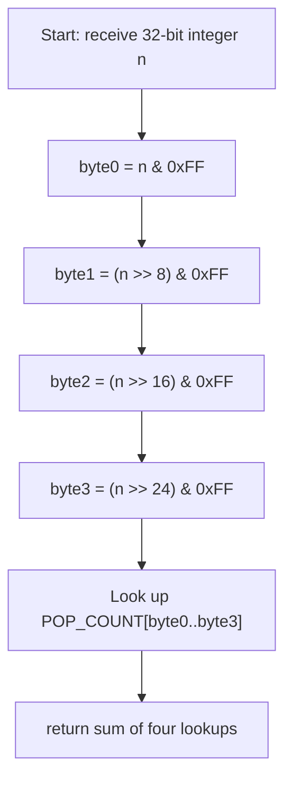

## Data Structures

**Inputs:**

* **`n: int`**: a 32-bit unsigned integer whose set bits (1-bits) we need to count.

**Auxiliary Variables:**

* **`POP_COUNT: list[int]`**: class-level lookup table of length 256. `POP_COUNT[i]` holds the number of 1-bits in the 8-bit integer `i`, precomputed via `bin(i).count('1')`.

## Overall Approach

We split the 32-bit integer into **four 8-bit bytes** and use a **precomputed lookup table** to count the 1-bits in each byte, then sum the four counts.

1. **Build the lookup table (once, at class load)**

    ```python
    POP_COUNT = [bin(i).count('1') for i in range(2**8)]
    ```

    Precompute the popcount for every possible 8-bit value (0–255).

2. **Extract each byte with a mask**

    Use `n & 0xFF` to isolate the lowest 8 bits, then right-shift `n` by 8, 16, and 24 bits to access the remaining three bytes.

3. **Look up and sum**

    ```python
    return (POP_COUNT[n & 0xFF]
          + POP_COUNT[(n >> 8) & 0xFF]
          + POP_COUNT[(n >> 16) & 0xFF]
          + POP_COUNT[(n >> 24) & 0xFF])
    ```

    Each table lookup is O(1); four lookups and three additions give the total Hamming weight.



## Step-by-Step Walkthrough

1. **`POP_COUNT` table**: Built once when the class is loaded. Entry `POP_COUNT[13]` = 3 because `13` = `0b1101` has three 1-bits.
2. **`n & 0xFF`**: Masks the lowest 8 bits (bits 0–7) and looks up the count.
3. **`(n >> 8) & 0xFF`**: Shifts right by 8 to bring bits 8–15 into the low byte, then looks up the count.
4. **`(n >> 16) & 0xFF`**: Shifts right by 16 to bring bits 16–23 into the low byte, then looks up the count.
5. **`(n >> 24) & 0xFF`**: Shifts right by 24 to bring bits 24–31 into the low byte, then looks up the count.
6. **Return**: Sum the four byte-level popcounts to get the total number of 1-bits.

## Complexity Analysis

* **Time:** $O(1)$

    The input is always a 32-bit integer. We perform exactly four table lookups and three additions regardless of the value of `n`.

* **Space:** $O(1)$

    The lookup table has a fixed size of 256 entries, independent of the input.
