## Data Structures

**Inputs:**

* `nums`: sequence of non-negative values $\{a_i\}_{i=0}^{n-1}$.

**Auxiliary Variables:**

* $n$: length of the sequence.
* $\text{dp}$: array of length $n$, where

  $$
    \text{dp}[i] = \max\bigl(\text{total robbable from }a_0\ldots a_i\bigr).
  $$
* $i$: index running from $0$ to $n-1$.

## What Happens in `rob`?

We exploit an **optimal substructure**: for each house $i$, the best total up through $i$ is either

1. **Skip** house $i$: carry forward the best through $i-1$.
2. **Rob**   house $i$: take its value $a_i$ plus the best through $i-2$.

This yields the recurrence

$$
  \text{dp}[i] \;=\;\max\bigl(\text{dp}[i-1],\;a_i + \text{dp}[i-2]\bigr).
$$

```mermaid
flowchart TD
    A["Start: compute n, handle n ≤ 1 base cases"] --> B["Initialize dp[0] and dp[1]"]
    B --> C["For i = 2 to n-1:"]
    C --> D["compute skip = dp[i-1]"]
    D --> E["compute take = a_i + dp[i-2]"]
    E --> F["dp[i] = max(skip, take)"]
    F --> G{"more i?"}
    G -->|Yes| C
    G -->|No| H["Return dp[n-1]"]
    H --> I["Done"]
```

### I. Initialization

* **Base cases:**

  $$
    \text{dp}[0] = a_0,\quad
    \text{dp}[1] = \max(a_0, a_1).
  $$
* If $n=0$, answer = 0; if $n=1$, answer = $a_0$.

### II. Recurrence Step

For each $i\in [2,\,n-1]$:

1. **Skip current**:
   $\text{skip} = \text{dp}[i-1]$.
2. **Take current**:
   $\text{take} = a_i + \text{dp}[i-2]$.
3. **Optimal choice**:

   $$
     \text{dp}[i] = \max(\text{skip},\,\text{take}).
   $$

## Example

Let $\{a_i\} = [2,\,7,\,9,\,3,\,1]$. Then

|   $i$  |  0  |  1  |  2  |  3  |  4  |
| :----: | :-: | :-: | :-: | :-: | :-: |
|  $a_i$ |  2  |  7  |  9  |  3  |  1  |
| dp\[i] |  2  |  7  |  11 |  11 |  12 |

* **i=2:** $\max(dp[1]=7,\;9+dp[0]=11)=11$.
* **i=3:** $\max(11,\;3+7=10)=11$.
* **i=4:** $\max(11,\;1+11=12)=12$.

Final answer: **12**.

## Complexity

* **Time:** $\displaystyle O(n)$, one pass through the array.
* **Space:** $\displaystyle O(n)$, for the DP array (can be reduced to $O(1)$ by keeping only two previous values).
