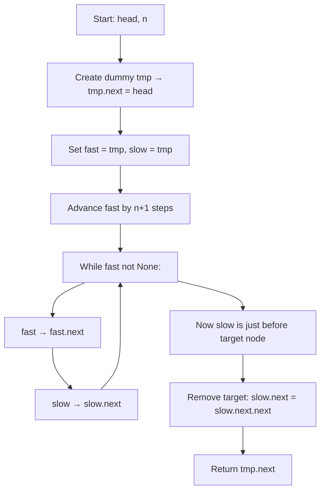

## Data Structures

**`ListNode`**

* A node in a singly-linked list with attributes:

  * **val**: the integer value stored in the node.
  * **next**: a reference to the next `ListNode` (or **None**).

**`head`**

* A `ListNode` pointer to the start of the list.

**`tmp`**

* A dummy `ListNode` created with value 0 and **next** pointing to **head**, to simplify edge‐case removal.

**`fast`, `slow`**

* Two pointers initialized to **tmp**:

  * **fast** advances ahead to create an n-node gap.
  * **slow** trails behind and will end up just before the node to remove.

---

## What happens in `removeNthFromEnd()`



1. **Dummy node setup**

   ```python
   tmp = ListNode(0, head)
   fast = tmp
   slow = tmp
   ```

   * Using a dummy simplifies removal when the head itself must be deleted.

2. **Advance the fast pointer**

   ```python
   for _ in range(n + 1):
       fast = fast.next
   ```

   * Moves **fast** ahead by **n+1** nodes so that the gap between **fast** and **slow** is **n+1**.

3. **Move both pointers together**

   ```python
   while fast:
       slow = slow.next
       fast = fast.next
   ```

   * When **fast** reaches the end (**None**), **slow** is positioned just before the node to remove (the nth from the end).

4. **Remove the nth node from end**

   ```python
   slow.next = slow.next.next
   ```

   * Skips over the target node, unlinking it from the list.

5. **Return new head**

   ```python
   return tmp.next
   ```

   * **tmp.next** now points to the possibly updated head (in case the original head was removed).

---

## Complexity

* **Time:** O(L), where L is the length of the list.

  * First loop advances **fast** by **n+1** steps: O(n).
  * Second loop moves both pointers until **fast** hits the end: up to O(L−n).

* **Space:** O(1)

  * Only a constant number of pointers and a dummy node are used.
