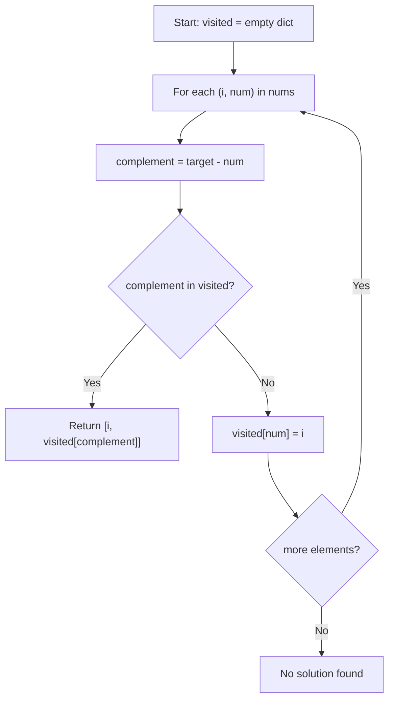

## Data Structures

* **`visited`**: a hash map (`dict`) mapping each previously seen number to its index in `nums`.
* **`complement`**: for the current element `num`, this is `target - num` — the value we need to find in `visited` to form a valid pair.

## Overall Approach

We make a single pass through the array. For each element, we compute its complement with respect to the target. If the complement has already been seen (i.e. it exists in the hash map), we immediately return both indices. Otherwise, we record the current number and its index in the map and move on.

This replaces the brute-force $O(n^2)$ nested-loop approach (shown commented out in the source) with a single-pass hash map lookup.



**Step-by-step walkthrough:**

1. Initialize an empty dictionary `visited`.

   ```python
   visited = dict()
   ```

2. Iterate through `nums` with index `i` and value `num`.

   ```python
   for i, num in enumerate(nums):
   ```

3. Compute the complement needed to reach `target`.

   ```python
   complement = target - num
   ```

4. If the complement is already in `visited`, we have found the pair — return both indices.

   ```python
   if complement in visited:
       return [i, visited[complement]]
   ```

5. Otherwise, store `num -> i` in `visited` so future iterations can find it.

   ```python
   visited[num] = i
   ```

## Complexity Analysis

* **Time Complexity:**
  We traverse the list once, and each hash map lookup / insertion is $O(1)$ amortised.

  $$
    O(n).
  $$

* **Space Complexity:**
  In the worst case every element is stored in the hash map before finding a match.

  $$
    O(n).
  $$
