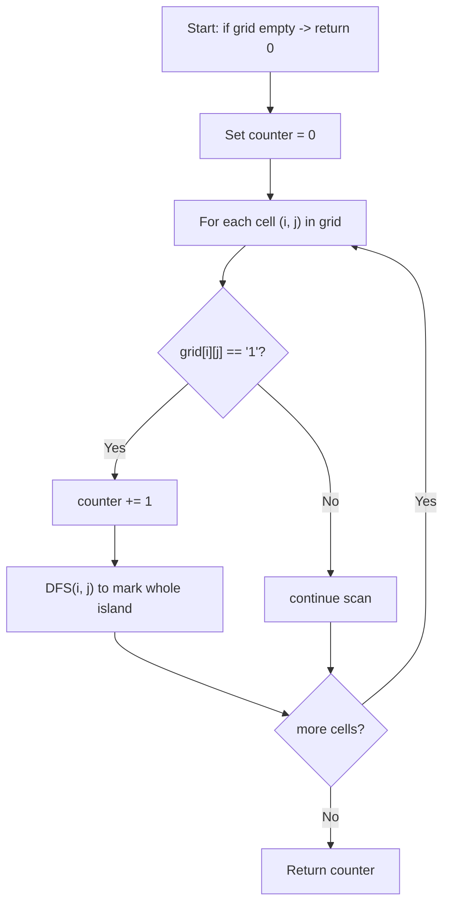

## Data Structures

* **`grid`**: an $m\times n$ matrix of characters (`'1'` for land, `'0'` for water).
* **Dimensions**:

  $$
    m = \#\text{rows},\quad n = \#\text{cols}.
  $$
* **`counter`**: integer tally of discovered islands.

We reuse the input matrix itself as a **visited marker** by flipping visited land cells from `'1'` to `'0'`.

## Overall Approach

We view the grid as an undirected graph on cells, where each land cell is connected to its four orthogonal neighbors. An **island** is a connected component of land. We count islands by scanning every cell and launching a **flood-fill** (DFS) whenever we find unvisited land, marking that entire component as water so it isn’t counted again.

**DFS(i,j):**

1. If $(i,j)$ is out-of-bounds or water, return.
2. Mark as water: `grid[i][j] = '0'`.
3. Recurse on four neighbors:
   $\bigl(i\!+\!1,j\bigr),\,(i\!-\!1,j),\,(i,j\!+\!1),\,(i,j\!-\!1)$.

## Complexity Analysis

* **Time Complexity:**
  Each cell is visited at most once in the outer scan and at most once in a DFS.

  $$
    O(m \times n).
  $$
* **Space Complexity:**
  Recursion depth can reach the size of an island in the worst case (all land), i.e.

  $$
    O(m \times n)
  $$

  for the call stack (or $O(\min(m,n))$ on average for balanced shapes).

