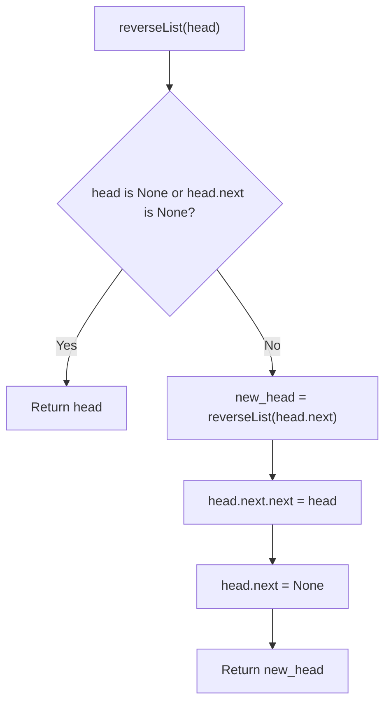

## Data Structures

* **`head`**: the current node at the front of the list segment being reversed.
* **`new_head`**: the head of the reversed sublist returned by the recursive call.
* **Linked list pointers**: `next` references are rewired in place to reverse the list.

## Overall Approach

The implementation uses **recursion** to reverse the linked list from the tail back toward the head. Once the recursive call reverses the rest of the list, the current node is attached to the end of that reversed portion.



1. The base case handles an empty list or a single-node list.
2. Recursively reverse the list starting at `head.next`.
3. Once the smaller list is reversed, point `head.next.next` back to `head`.
4. Set `head.next` to `None` so the old forward link does not create a cycle.

## Complexity Analysis

* **Time Complexity**: `O(n)`, because each node is visited once.
* **Space Complexity**: `O(n)` due to the recursion stack.

## Key Insights

* The recursive call returns the new head of the fully reversed suffix.
* `head.next.next = head` is the key pointer flip that reverses the local edge.
* Resetting `head.next = None` is necessary to terminate the reversed list correctly.
* The source file also keeps a commented iterative version, but the active implementation is the recursive one described above.

## Source Code Analysis

```python
# Definition for singly-linked list.
# class ListNode:
#     def __init__(self, val=0, next=None):
#         self.val = val
#         self.next = next
class Solution:
    def reverseList(self, head: Optional[ListNode]) -> Optional[ListNode]:
        '''
        prev, curr = None, head

        while curr:
            nxt = curr.next
            curr.next = prev
            prev = curr
            curr = nxt

        return prev
        '''
        # base case
        if head is None or head.next is None:
            return head

        # recursive case
        new_head = self.reverseList(head.next)
        head.next.next = head
        head.next = None

        return new_head
```

## Related Problems

* Reverse Linked List II
* Palindrome Linked List
* Reorder List
