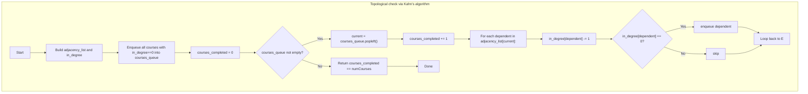

## Data Structures

**Inputs:**  
- `numCourses` (`N`): total number of courses labeled `0…N−1`.  
- `prerequisites`: list of pairs `[course, prereq]`, meaning to take `course` you must first take `prereq`.

**Auxiliary Structures:**  
- `adjacency_list: List[List[int]]` of length `N`, where  
  ```python
  adjacency_list[u] = [ v1, v2, … ]
  ```  
  lists all courses that depend directly on course _u_ (i.e. edges `u → v`).  
- `in_degree: List[int]` of length `N`, where  
  ```python
  in_degree[v] = number of prerequisites v has
  ```  
- `courses_queue: deque[int]`  
  a queue of courses with zero unmet prerequisites.  
- `courses_completed: int`  
  counter for how many courses we’ve “taken” in our topological process.

---

## What happens in `canFinish`

We use **Kahn’s algorithm** for topological sorting to detect whether the directed graph of course dependencies has a cycle. If we can “take” all courses, return `True`; otherwise `False`.



1. **Build graph & in‑degrees**  
   ```python
   adjacency_list = [[] for _ in range(N)]
   in_degree      = [0]*N
   for course, prereq in prerequisites:
       adjacency_list[prereq].append(course)
       in_degree[course] += 1
   ```
2. **Initialize queue**  
   ```python
   from collections import deque
   courses_queue = deque(
       c for c in range(N) if in_degree[c] == 0
   )
   courses_completed = 0
   ```
3. **Process in topological order**  
   While the queue isn’t empty:
   - Pop a course `current`, increment `courses_completed`.  
   - For each `dependent` course in `adjacency_list[current]`, decrement its `in_degree`.  
   - If `in_degree[dependent]` drops to zero, enqueue it—meaning all its prerequisites are now satisfied.
4. **Cycle detection**  
   After processing, if `courses_completed == N`, we’ve successfully taken every course in some order (no cycle) → return `True`. Otherwise → return `False`.

---

## Example

```python
numCourses = 4
prerequisites = [[1,0], [2,0], [3,1], [3,2]]
```

- Dependencies:  
  ```
  0 → 1
  0 → 2
  1 → 3
  2 → 3
  ```
- **in_degree** starts as `[0,1,1,2]`.  
- **Queue init**: `[0]` (only course 0 has none).  
- **Process 0** → completed=1 → decrement in_degree of 1 and 2 → becomes `[0,0,0,2]` → enqueue `[1,2]`.  
- **Process 1** → completed=2 → decrement in_degree of 3 → becomes `[0,0,0,1]`.  
- **Process 2** → completed=3 → decrement in_degree of 3 → becomes `[0,0,0,0]` → enqueue `[3]`.  
- **Process 3** → completed=4.  
- Since `courses_completed == 4`, return **True**.

If there were a cycle (e.g. add `[0,3]`), no topological order would cover all courses and we’d return **False**.

---

## Complexity

- **Time:**  
  - Building adjacency list and in‑degree: **O(N + P)** where `P = len(prerequisites)`.  
  - Each course is enqueued and dequeued at most once, and each prerequisite edge is examined exactly once → **O(N + P)** overall.

- **Space:**  
  - **O(N + P)** for the adjacency list and in‑degree array, plus **O(N)** for the queue.
