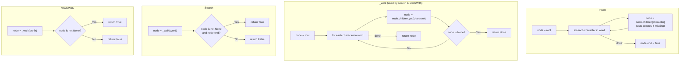

## Data Structures

- **`Node`**: A trie node containing:
- **`children: defaultdict(Node)`** — maps each character to its child `Node`. Using `defaultdict` auto-creates missing children on insertion.
- **`end: bool`** — `True` if this node marks the last character of a previously inserted word.

- **`self.root: Node`** — the root of the trie. It holds no character itself; all words branch from its `children`.

- **`node: Node`** — a cursor that walks down the trie one character at a time during insert, search, and prefix queries.

## Overall Approach

The trie stores words as character-by-character paths from the root. Each edge represents one character, and terminal nodes are flagged with `end = True`. All three operations share the same downward walk:

- **Insert** — walk (or create) a path for every character, then mark the final node.
- **Search** — walk the path; succeed only if every character exists *and* the final node is marked `end`.
- **StartsWith** — walk the path; succeed if every character exists (no `end` check needed).

A private `_walk` helper factors out the common traversal logic used by both `search` and `startsWith`.



## Step-by-Step Breakdown

### I. Node Structure

Each node is a lightweight container with a child map and a terminal flag:

```python
class Node:
    def __init__(self):
        self.children = defaultdict(Node)
        self.end = False
```

`defaultdict(Node)` means accessing a missing key automatically inserts a new empty `Node`, which simplifies insertion.

### II. Insert

Walk down the trie, creating nodes as needed, then mark the end:

```python
def insert(self, word: str) -> None:
    node = self.root
    for character in word:
        node = node.children[character]   # auto-creates child if absent
    node.end = True
```

For the word `"app"`:
1. `node = root` → move to `root.children['a']` (created if new).
2. Move to `children['p']`.
3. Move to `children['p']`.
4. Set `node.end = True`.

### III. The `_walk` Helper

Both `search` and `startsWith` need to follow an existing path without creating nodes:

```python
def _walk(self, word: str) -> Optional[Node]:
    node = self.root
    for character in word:
        node = node.children.get(character)   # returns None if absent
        if node is None:
            return None
    return node
```

Using `.get()` instead of `[]` avoids auto-creating nodes in the `defaultdict`.

### IV. Search

A word exists only if every character is present *and* the final node is a terminal:

```python
def search(self, word: str) -> bool:
    node = self._walk(word)
    return node is not None and node.end
```

### V. StartsWith

A prefix exists if every character is present — no terminal check required:

```python
def startsWith(self, prefix: str) -> bool:
    node = self._walk(prefix)
    return node is not None
```

## Example

Insert `"apple"` and `"app"`, then query:

```
root
 └─ a
    └─ p
       └─ p  (end=True after inserting "app")
          └─ l
             └─ e  (end=True after inserting "apple")
```

| Operation              | Walk path         | Result  | Reason                          |
| :--------------------- | :---------------- | :-----: | :------------------------------ |
| `search("apple")`      | a → p → p → l → e | `True`  | path exists, `end=True`         |
| `search("app")`        | a → p → p         | `True`  | path exists, `end=True`         |
| `search("ap")`         | a → p              | `False` | path exists but `end=False`     |
| `startsWith("app")`    | a → p → p         | `True`  | path exists                     |
| `search("banana")`     | b → `None`         | `False` | `_walk` returns `None` at `'b'` |

## Complexity

- **Time:**
- `insert`: $O(L)$ where $L$ is the length of the word — one node visited or created per character.
- `search` / `startsWith`: $O(L)$ — one dictionary lookup per character.

- **Space:** $O(N \cdot C)$ where $N$ is the total number of characters across all inserted words and $C$ is the character set size (up to 26 for lowercase English). In the worst case with no shared prefixes, every character creates a new node.
