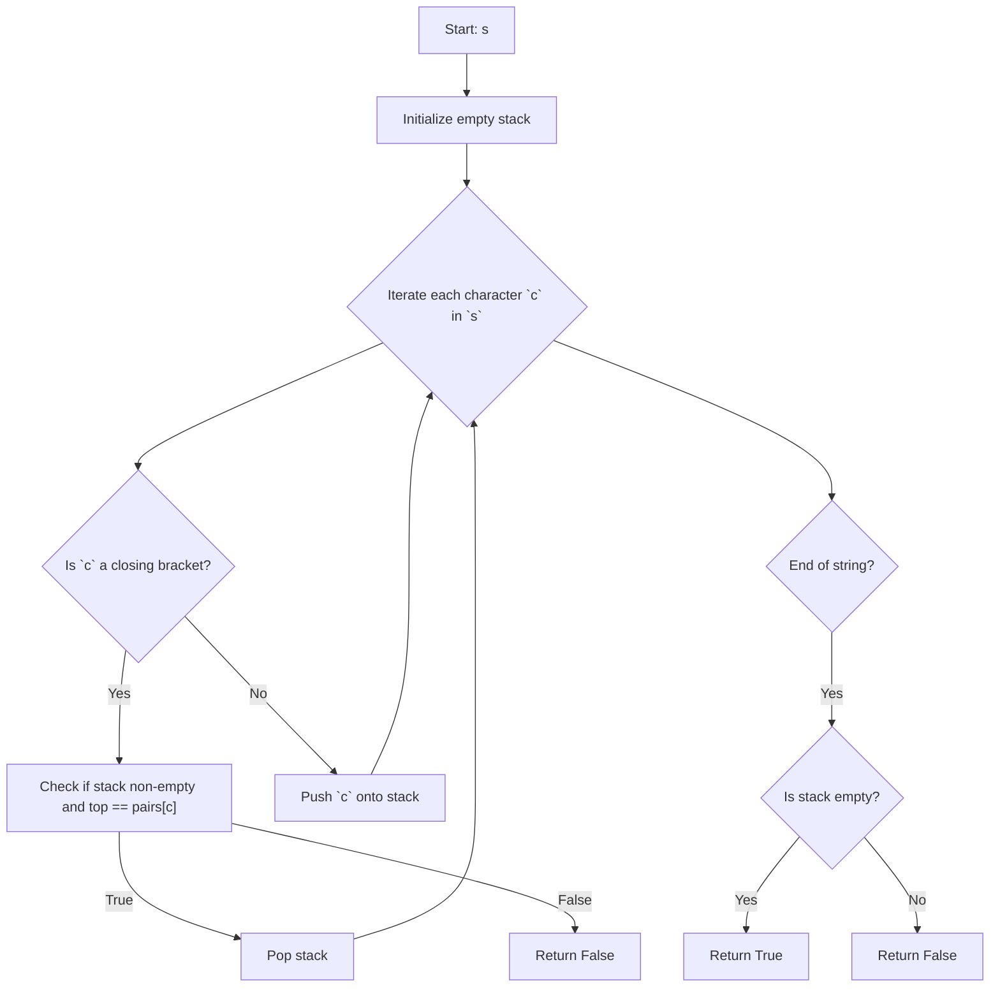

## Data Structures

**`s`**

* A string of characters, each one of: `'('`, `')'`, `'{'`, `'}'`, `'['`, `']'`.

**`stack`**

* A list (used as a stack) to keep track of opening brackets encountered.

**`pairs`**

* A dictionary mapping closing brackets to their corresponding opening brackets:

  ```python
  pairs = {')': '(', '}': '{', ']': '['}
  ```

## What happens in `isValid(s)`



1. **Initialize**

   ```python
   stack = []
   pairs = {')': '(', '}': '{', ']': '['}
   ```

2. **Process each character**

   ```python
   for c in s:
   ```

   * **If `c` is a closing bracket** (`')'`, `'}'`, or `']'`):

     1. Check that `stack` is not empty **and** its top element equals `pairs[c]`.
     2. If so, pop the stack; otherwise, the string is invalid → **return `False`**.

     ```python
     if c in pairs:
         if not stack or stack[-1] != pairs[c]:
             return False
         stack.pop()
     ```
   * **If `c` is an opening bracket** (`'('`, `'{'`, `'['`):

     * Push it onto the stack:

     ```python
     else:
         stack.append(c)
     ```

3. **Final check**

   * After processing all characters, if `stack` is empty, every opening bracket had a matching closer in correct order → **return `True`**.
   * Otherwise, some openings weren’t closed → **return `False`**.

   ```python
   return not stack
   ```

## Complexity

* **Time:** O(n), where n = `len(s)`.

  * Each character is processed once.
  * Stack operations (`append`, `pop`, `[-1]`) are O(1).

* **Space:** O(n) in the worst case (all characters are opening brackets and pushed onto the stack).
