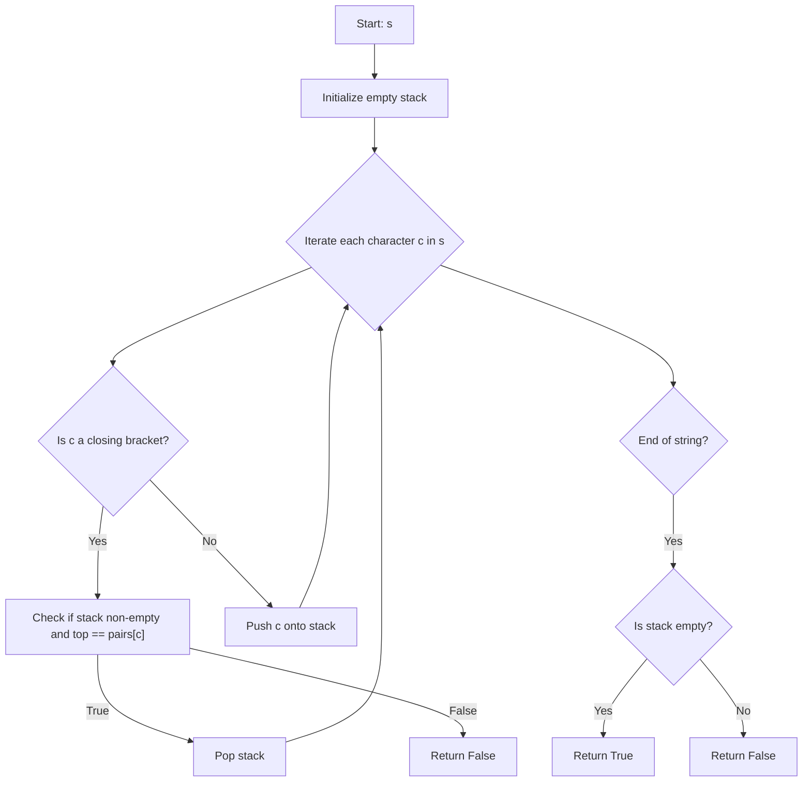

## Data Structures

**s**

* A string of characters, each one of: ‘(’, ‘)’, ‘{’, ‘}’, ‘\[’, ‘]’.

**stack**

* A list (used as a stack) to keep track of opening brackets encountered.

**pairs**

* A mapping from each closing bracket to its matching opening bracket:

  ```
  pairs = {
    ')' : '(',
    '}' : '{',
    ']' : '['
  }
  ```

## What happens in isValid(s)



1. **Initialize**

   ```python
   stack = []
   pairs = {')': '(', '}': '{', ']': '['}
   ```

2. **Process each character**

   * Loop over each character (call it **c**) in **s**.
   * If **c** is one of the closing brackets (i.e. it appears as a key in **pairs**):

     1. Verify that **stack** is not empty **and** that its top element equals **pairs\[c]**.
     2. If that check fails, return **False** immediately; otherwise pop the top of **stack**.
   * If **c** is not a closing bracket, treat it as an opening bracket and append it to **stack**.

3. **Final check**

   * After the loop finishes, if **stack** is empty then every opening bracket had a matching closer in the correct order → return **True**.
   * Otherwise there were unmatched openings → return **False**.

## Complexity

* **Time:** O(n), where n is the length of **s**. Each character is looked at exactly once.
* **Space:** O(n) in the worst case, since all characters could be opening brackets and pushed onto **stack**.
