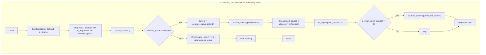

## Data Structures

**Inputs:**  
- `number_of_courses` (`N`): total number of courses, labeled `0…N−1`.  
- `prereq_pairs`: list of pairs `[course, prereq]`, indicating each `course` depends on `prereq`.

**Auxiliary Structures:**  
- `adjacency_list: List[List[int]]` of length `N`, where  
  ```python
  adjacency_list[u] = [v1, v2, …]
  ```  
  lists all courses `v` that have `u` as a prerequisite (i.e. edges `u → v`).

- `in_degree: List[int]` of length `N`, where  
  ```python
  in_degree[v] = number of prerequisites v currently has
  ```  

- `courses_queue: deque[int]`  
  holds all courses with zero unmet prerequisites, ready to take.

- `course_order: List[int]`  
  accumulates the topological ordering of courses as we “take” them.

---

## What happens in `findOrder`

We perform **Kahn’s topological sort**, enqueueing all courses with no prerequisites, then repeatedly “taking” one, appending it to the order, and decrementing the in‑degree of its dependents—enqueuing any that become ready. If we end up ordering all courses, return that sequence; otherwise return an empty list to signal a cycle.



### Step‑by‑step

1. **Build graph & in‑degrees**  
   ```python
   adjacency_list = [[] for _ in range(N)]
   in_degree      = [0]*N
   for course, prereq in prereq_pairs:
       adjacency_list[prereq].append(course)
       in_degree[course] += 1
   ```
2. **Initialize queue**  
   ```python
   from collections import deque
   courses_queue = deque(
       c for c in range(N) if in_degree[c] == 0
   )
   course_order = []
   ```
3. **Process in topological order**  
   While `courses_queue` isn’t empty:
   - Pop `current`, append it to `course_order`.  
   - For each dependent `next_course` in `adjacency_list[current]`:
     1. Decrement `in_degree[next_course]`.  
     2. If it becomes zero, enqueue it.
4. **Return result**  
   ```python
   if len(course_order) == N:
       return course_order  # valid topological order
   else:
       return []            # cycle detected
   ```

---

## Example

```python
number_of_courses = 4
prereq_pairs = [[1,0], [2,0], [3,1], [3,2]]
```

- Build:
  ```
  0 → [1, 2]
  1 → [3]
  2 → [3]
  3 → []
  in_degree = [0,1,1,2]
  ```
- Queue init: `[0]`.  
- Process order:
  1. Pop **0**, order = `[0]`, decrement in_degree of 1 & 2 → both become 0 → enqueue `[1,2]`.  
  2. Pop **1**, order = `[0,1]`, decrement in_degree of 3 → becomes 1.  
  3. Pop **2**, order = `[0,1,2]`, decrement in_degree of 3 → becomes 0 → enqueue `[3]`.  
  4. Pop **3**, order = `[0,1,2,3]`.  
- Since length is 4, return `[0,1,2,3]` (one valid ordering).

---

## Complexity

- **Time:**  
  - Building adjacency list and in‑degree: **O(N + P)** where `P = len(prereq_pairs)`.  
  - Each course is enqueued/dequeued once, and each edge is considered exactly once.  
  - **Overall:** O(N + P).

- **Space:**  
  - **O(N + P)** for the adjacency list and in-degree array, plus **O(N)** for the queue and output list.
