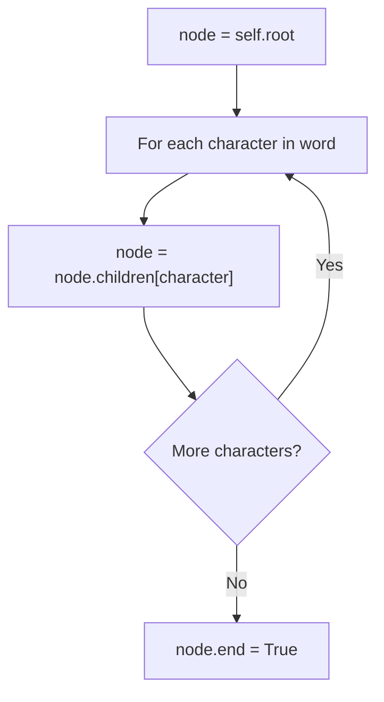
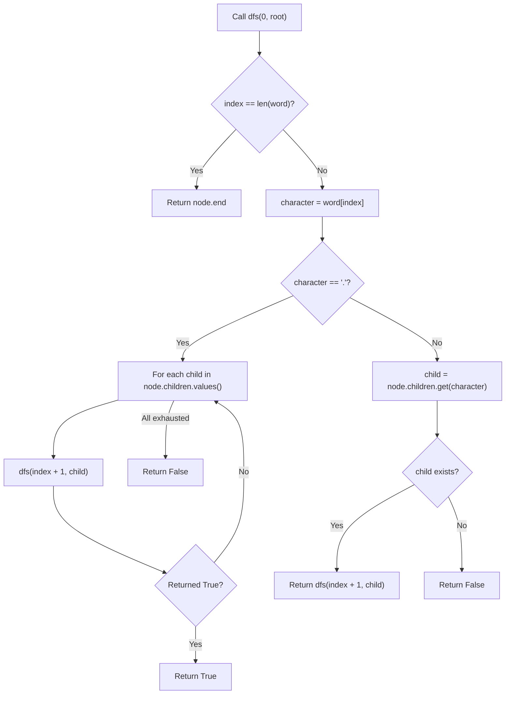

## Data Structures

**`self.root`**

* A `Node` object that serves as the root of the trie (prefix tree). Every word stored in the dictionary hangs off this root.

**`Node.children`**

* A `defaultdict(Node)` mapping each character to a child `Node`. Using `defaultdict` means accessing a missing key auto-creates a new node.

**`Node.end`**

* A boolean flag. `True` if this node marks the final character of a complete word, `False` otherwise.

## What happens in `addWord()`?

Starting from the root, walk down the trie one character at a time, creating nodes as needed, then mark the last node as a word ending.



1. **Start at the root**
   ```python
   node = self.root
   ```
2. **Walk character by character**
   ```python
   for character in word:
       node = node.children[character]
   ```
   Because `children` is a `defaultdict(Node)`, any new character automatically creates a fresh child node.
3. **Mark end of word**
   ```python
   node.end = True
   ```

## What happens in `search()`?

Search uses **DFS** through the trie. For normal characters it follows the matching child. For the wildcard `'.'` it branches into every child, returning `True` if any branch succeeds.



1. **Base case — end of pattern**
   ```python
   if index == len(word):
       return node.end
   ```
   We've matched every character; the answer depends on whether this node is a word ending.

2. **Wildcard `'.'` — try all children**
   ```python
   if character == '.':
       for child in node.children.values():
           if dfs(index + 1, child):
               return True
       return False
   ```
   Each child represents a valid match for `'.'`. If any subtree finds the remaining pattern, return `True` immediately.

3. **Literal character — follow the matching child**
   ```python
   child = node.children.get(character)
   return dfs(index + 1, child) if child is not None else False
   ```
   Use `.get()` instead of direct indexing to avoid creating empty nodes during search.

## Complexity

- **Time:**
- `addWord`: $O(L)$ where L is the length of the word. Each character requires one trie traversal step.
- `search` (no wildcards): $O(L)$ — a single path through the trie.
- `search` (with wildcards): $O(N)$ in the worst case, where N is the total number of nodes in the trie. A pattern of all `'.'` characters can visit every node. For a fully populated trie this becomes $O(26^L)$.

- **Space:**
- $O(T)$ where T is the total number of characters across all stored words. Each character occupies at most one trie node. The DFS recursion stack uses at most $O(L)$ additional space per search call.
