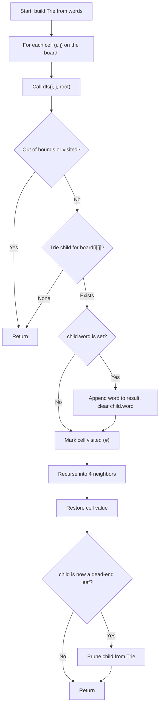

## Data Structures

**Inputs:**

* `board`: 2-D list of characters with dimensions $m \times n$.
* `words`: list of strings to search for on the board.

**Auxiliary Variables:**

* `result`: list collecting every word found on the board.
* `self.root`: root `Node` of the Trie built from `words`.

**Trie Node (`Node`):**

* `children`: `defaultdict(Node)` mapping a character to its child node.
* `word`: `None` by default; set to the full word string at the terminal node of each inserted word.

**DFS temporaries:**

* `i`, `j`: current cell coordinates on the board.
* `node`: the current Trie node being matched against.
* `character`: the original value of `board[i][j]` (saved before marking visited).
* `child`: the Trie child for the current character, or `None` if no match.

## Overall Approach

We build a **Trie** from the word list, then launch a **depth-first search** from every cell on the board. At each cell we walk one level deeper into the Trie; if no child exists for the current character the search prunes immediately. When we reach a terminal node (one storing a complete word), we record it in the result and clear the marker to avoid duplicates. After backtracking, we also prune Trie leaves that no longer lead to any remaining word.



### I. Build the Trie

```python
self.root = Node()
for word in words:
    node = self.root
    for character in word:
        node = node.children[character]
    node.word = word
```

Each word is inserted character by character. The last node stores the full word string so we can collect it later without reconstructing the path.

### II. DFS from Every Cell

```python
for i in range(m):
    for j in range(n):
        dfs(i, j, self.root)
```

We try starting a search from every position on the board, passing in the Trie root each time.

### III. Recursive Search

III.A. **Boundary and visit check**

```python
if i < 0 or i >= m or j < 0 or j >= n:
    return
character = board[i][j]
if character == '#':
    return
```

Out-of-bounds cells and already-visited cells (marked `'#'`) are skipped.

III.B. **Trie match check**

```python
child = node.children.get(character)
if child is None:
    return
```

If the current character has no corresponding Trie child, no word in the list can be formed along this path — prune.

III.C. **Word collection**

```python
if child.word:
    result.append(child.word)
    child.word = None
```

When a terminal node is reached, the word is recorded and the marker is cleared so the same word is not added twice.

III.D. **Visit, recurse, restore**

```python
board[i][j] = '#'

dfs(i + 1, j, child)
dfs(i - 1, j, child)
dfs(i, j + 1, child)
dfs(i, j - 1, child)

board[i][j] = character
```

The cell is temporarily marked visited, the four cardinal neighbors are explored one level deeper in the Trie, and the cell is restored on backtrack.

III.E. **Trie pruning**

```python
if child.word is None and not child.children:
    del node.children[character]
```

After backtracking, if the child node has no stored word and no remaining children, it is a dead-end leaf. Removing it prevents future DFS paths from entering a branch of the Trie that can no longer yield any result.

## Example

```python
board = [["o","a","a","n"],
         ["e","t","a","e"],
         ["i","h","k","r"],
         ["i","f","l","v"]]
words = ["oath","pea","eat","rain"]
```

**Trie after insertion:**

```
root ─ o ─ a ─ t ─ h  (word="oath")
     ─ p ─ e ─ a      (word="pea")
     ─ e ─ a ─ t       (word="eat")
     ─ r ─ a ─ i ─ n   (word="rain")
```

**DFS from cell (0,0) = 'o':**

- Trie root has child `'o'` → descend.
- (1,0) = `'e'` — child `'o'` has no `'e'` child → prune.
- (0,1) = `'a'` — child `'o'` has `'a'` child → descend.
  - (1,1) = `'t'` — `'a'` has `'t'` child → descend.
    - (2,1) = `'h'` — `'t'` has `'h'` child with `word="oath"` → **collect "oath"**.

**DFS from cell (1,1) = 't':**

- No `'t'` child at root → prune immediately.

**DFS from cell (1,0) = 'e':**

- Root has child `'e'` → descend.
- (0,0) = `'o'` — no `'o'` child under `'e'` → prune.
- (1,1) = `'a'` → (2,1) = `'t'` with `word="eat"` → **collect "eat"**.

Result: `["oath", "eat"]`.

## Complexity

* **Time:**
  Building the Trie costs $O(W)$ where $W$ is the total number of characters across all words. The DFS explores up to $4^L$ directions per starting cell (where $L$ is the maximum word length), but Trie pruning aggressively cuts branches. In the worst case:

  $$O(m \times n \times 4^L)$$

  In practice, Trie pruning makes this significantly faster.

* **Space:**
  - The Trie stores up to $O(W)$ nodes.
  - The DFS recursion stack is at most $O(L)$ deep.
  - Overall: $O(W + L)$.
