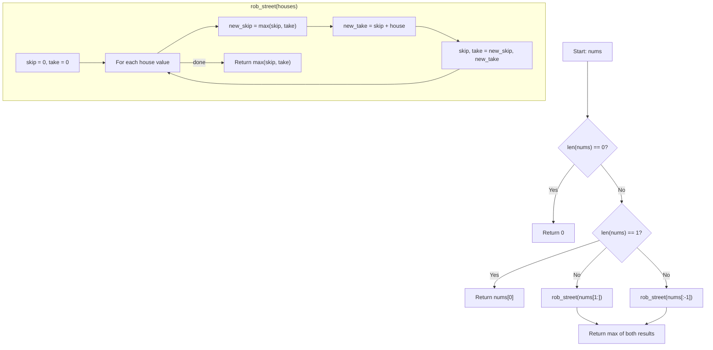

## Data Structures

**Inputs:**

* `nums`: list of non-negative integers where `nums[i]` is the money in house $i$. The houses form a **circle**, so house $0$ and house $n-1$ are adjacent.

**Auxiliary Variables:**

* `skip`: the maximum loot achievable up to the previous house **without** robbing it.
* `take`: the maximum loot achievable up to the previous house **while** robbing it.

## Overall Approach

Because the houses are arranged in a circle, robbing house $0$ forbids robbing house $n-1$ (and vice versa). We eliminate this circular dependency by reducing the problem to two independent **linear** subproblems:

1. Rob from houses $1$ to $n-1$ (exclude the first house).
2. Rob from houses $0$ to $n-2$ (exclude the last house).

Each subproblem is solved with the classic House Robber recurrence using two rolling variables, and the final answer is the maximum of the two results.



### I. Edge Cases

Handle trivially small inputs before entering the main logic:

```python
if not nums:
    return 0

if len(nums) == 1:
    return nums[0]
```

### II. Linear House Robber (`rob_street`)

The helper solves the non-circular version. Two variables track the best outcome at each step:

```python
def rob_street(houses):
    skip, take = 0, 0

    for house in houses:
        skip, take = max(skip, take), skip + house

    return max(skip, take)
```

At each house the decision is:

* **Skip this house** — keep the best of the two previous states: $\text{skip} = \max(\text{skip}, \text{take})$.
* **Rob this house** — must have skipped the previous one: $\text{take} = \text{skip} + \text{house}$.

This is equivalent to the recurrence $dp[i] = \max(dp[i-1],\; dp[i-2] + \text{nums}[i])$ compressed into $O(1)$ space.

### III. Combine Results

Run `rob_street` on the two non-overlapping slices and return the better outcome:

```python
return max(
    rob_street(nums[1:]),
    rob_street(nums[:-1])
)
```

## Example

```python
nums = [2, 3, 2]
```

**Subproblem 1** — `rob_street([3, 2])` (exclude house 0):

| Step | house | skip (before) | take (before) | skip (after) | take (after) |
| :--: | :---: | :-----------: | :-----------: | :----------: | :----------: |
|  1   |   3   |       0       |       0       |      0       |      3       |
|  2   |   2   |       0       |       3       |      3       |      2       |

Result: $\max(3, 2) = 3$.

**Subproblem 2** — `rob_street([2, 3])` (exclude house 2):

| Step | house | skip (before) | take (before) | skip (after) | take (after) |
| :--: | :---: | :-----------: | :-----------: | :----------: | :----------: |
|  1   |   2   |       0       |       0       |      0       |      2       |
|  2   |   3   |       0       |       2       |      2       |      3       |

Result: $\max(2, 3) = 3$.

**Final answer:** $\max(3, 3) = 3$. We rob either house 1 alone or house 0 alone.

## Complexity

* **Time:**
  Each call to `rob_street` performs a single pass over at most $n-1$ houses. Two calls give

  $$
    O(n).
  $$

* **Space:**
  Only two rolling variables are used per call, plus the input slices of size $n-1$.

  $$
    O(n)
  $$

  due to slicing. This can be reduced to $O(1)$ by passing index bounds instead of slices.
