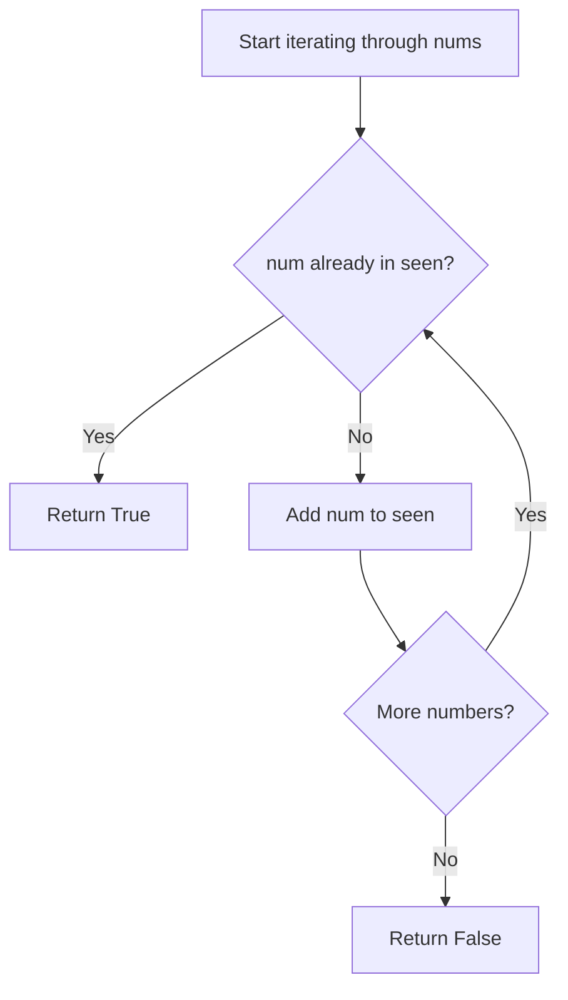

## Data Structures

* **`seen`**: a hash set storing values encountered so far.
* **`num`**: the current element from the input list being checked.

## Overall Approach

The solution scans the array once and uses a **set** for constant-time membership checks. If a value is already in `seen`, a duplicate exists and the function returns immediately.



1. Initialize an empty set.
2. Iterate through each number in the input list.
3. Return `True` on the first repeated value.
4. If the loop completes, all values were distinct.

## Complexity Analysis

* **Time Complexity**: $O(n)$ on average, where `n` is the length of `nums`.
* **Space Complexity**: $O(n)$ in the worst case if all numbers are unique.

## Key Insights

* A set avoids the need for sorting or nested loops.
* Early return makes the method efficient when a duplicate appears near the beginning.
* This is a standard pattern for uniqueness checks in arrays.

## Source Code Analysis

```python
from typing import List

class Solution:
    def containsDuplicate(self, nums: List[int]) -> bool:
        seen = set()

        for num in nums:
            if num in seen:
                return True
            seen.add(num)

        return False
```

## Related Problems

* Contains Duplicate II
* Valid Anagram
* Two Sum
