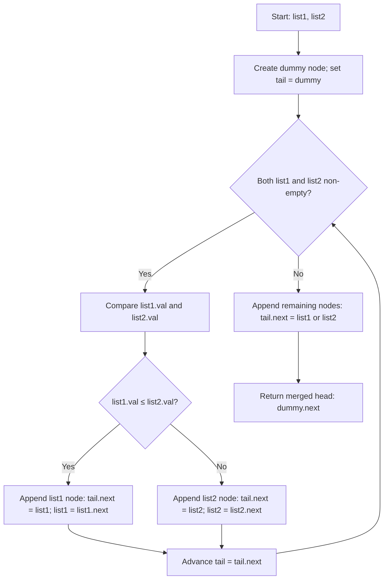

## Data Structures

**`ListNode`**

* A node in a singly-linked list with attributes:

  * **val**: the integer value stored in the node.
  * **next**: reference to the next `ListNode` (or **None**).

**`list1`, `list2`**

* Pointers to the heads of the two input sorted linked lists.

**`dummy`**

* A new `ListNode` (with default value) used as a placeholder to simplify edge-case handling.

**`tail`**

* A pointer that always points to the last node in the merged list under construction.
* Starts at **dummy** and advances as nodes are appended.

---

## What happens in mergeTwoLists()



1. **Initialize dummy and tail**

   ```python
   dummy = ListNode()
   tail = dummy
   ```

   * `dummy.next` will ultimately point to the head of the merged list.
   * `tail` tracks the end of the merged list as we build it.

2. **Merge by selecting smaller node**

   ```python
   while list1 and list2:
       if list1.val <= list2.val:
           tail.next = list1
           list1 = list1.next
       else:
           tail.next = list2
           list2 = list2.next
       tail = tail.next
   ```

   * As long as both lists have nodes, compare their current values:

     * Link the smaller (or equal) one to `tail.next`.
     * Advance that list’s pointer.
     * Move `tail` forward to the new last node.

3. **Attach any remaining nodes**

   ```python
   tail.next = list1 if list1 else list2
   ```

   * Whichever list still has nodes gets appended in one step.

4. **Return the merged list**

   ```python
   return dummy.next
   ```

   * `dummy.next` is the head of the newly merged sorted list.

---

## Complexity

* **Time:** O(m + n), where m and n are the lengths of the two input lists.

  * Each node from both lists is visited exactly once.

* **Space:** O(1)

  * Only constant extra space is used (the dummy node and pointers).
