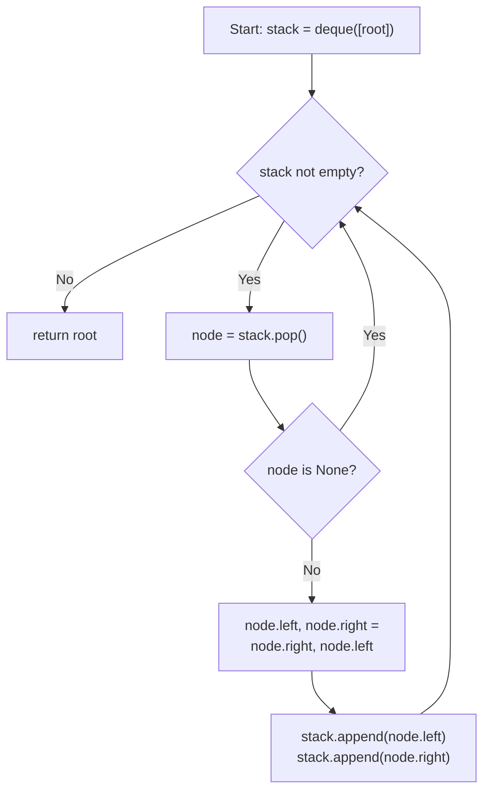

## Data Structures

**Inputs:**

* **`root: Optional[TreeNode]`**: root of the binary tree to invert.

**Auxiliary Variables:**

* **`queue: deque[TreeNode]`**: worklist holding nodes whose children still need to be swapped (used as a stack via `pop()`).
* **`node`**: the current node popped for processing.

## Overall Approach

We use a **stack-based iterative traversal** of the tree, swapping each node's left and right children as we visit it. Every non-`None` node is processed exactly once, and its children are pushed onto the stack for the same treatment. The traversal order (DFS vs BFS) does not matter — every node just needs its children swapped. By the time the stack is empty, every parent–child link has been mirrored.



## Step-by-Step Breakdown

### I. Base Case

```python
if root is None:
    return None
```

An empty tree is already its own inverse — return immediately.

### II. Initialize the Stack

```python
queue = deque([root])
```

Seed the stack with the root node.

### III. Process Each Node

```python
while queue:
    node = queue.pop()
    if node is None:
        continue
```

Pop a node from the stack. `None` children are harmlessly skipped via `continue`.

### IV. Swap Children

```python
    node.left, node.right = node.right, node.left
```

Mirror the two subtrees by swapping the left and right pointers in a single tuple assignment.

### V. Push Children

```python
    queue.append(node.left)
    queue.append(node.right)
```

Push both children (which may be `None`) onto the stack so their subtrees are inverted in subsequent iterations.

### VI. Return the Root

```python
return root
```

The root pointer itself hasn't changed — only the internal links have been mirrored.

## Example

```
Input:         Output:

      4              4
     / \            / \
    2   7          7   2
   / \ / \        / \ / \
  1  3 6  9      9  6 3  1
```

| Step | Popped | Swap performed | Stack after push |
| :--: | :----: | :------------- | :--------------- |
| 1 | `4` | `4.left ↔ 4.right` → children become `7, 2` | `[7, 2]` |
| 2 | `2` | `2.left ↔ 2.right` → children become `3, 1` | `[7, 3, 1]` |
| 3 | `1` | leaf — swap two `None`s | `[7, 3]` |
| 4 | `3` | leaf — swap two `None`s | `[7]` |
| 5 | `7` | `7.left ↔ 7.right` → children become `9, 6` | `[9, 6]` |
| 6 | `6` | leaf — swap two `None`s | `[9]` |
| 7 | `9` | leaf — swap two `None`s | `[]` |

## Complexity Analysis

* **Time:** $O(n)$

    Every node is popped and processed exactly once, where $n$ is the total number of nodes in the tree.

* **Space:** $O(n)$

    The stack can hold up to $O(n)$ nodes. For a complete binary tree the widest level contains roughly $n/2$ nodes, so the stack peaks at $O(n)$ entries.
