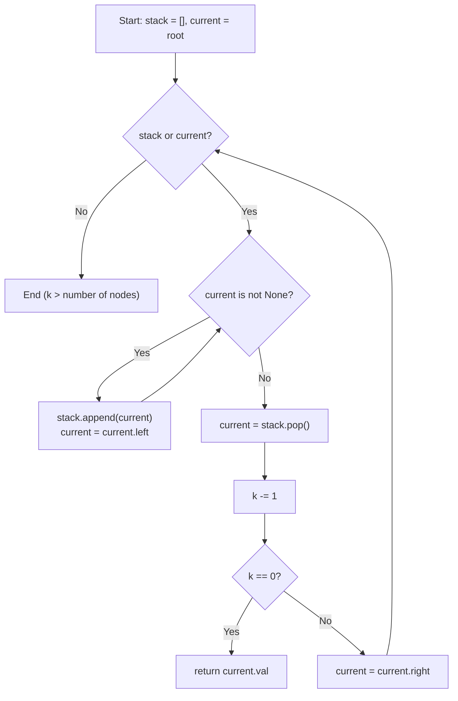

## Data Structures

**Inputs:**

* **`root: Optional[TreeNode]`**: root of the binary search tree.
* **`k: int`**: the 1-indexed position of the target element in sorted order.

**Auxiliary Variables:**

* **`stack: list[TreeNode]`**: an explicit stack that simulates the call stack of a recursive in-order traversal, holding ancestor nodes whose left subtrees are being explored.
* **`current`**: pointer to the node currently being descended into; starts at `root` and moves left until `None`, then advances right after processing a node.

## Overall Approach

We perform an **iterative in-order traversal** of the BST. Because in-order traversal visits BST nodes in ascending order, the $k$-th node visited is the $k$-th smallest element. We decrement `k` with each visit and return immediately when it hits zero, avoiding a full traversal.



## Step-by-Step Walkthrough

1. **Initialize the traversal state**

   ```python
   stack = []
   current = root
   ```

   The stack is empty and `current` points to the root. Together they will drive the in-order walk.

2. **Descend to the leftmost node**

   ```python
   while current:
       stack.append(current)
       current = current.left
   ```

   Push every node along the left spine onto the stack. When `current` becomes `None`, the top of the stack is the smallest unvisited node.

3. **Visit the next node in order**

   ```python
   current = stack.pop()
   ```

   Pop the most recent ancestor — this is the next node in ascending order.

4. **Check if this is the k-th element**

   ```python
   k -= 1
   if k == 0:
       return current.val
   ```

   Decrement the counter. If it reaches zero, we have visited exactly $k$ nodes in sorted order, so `current.val` is the answer.

5. **Move to the right subtree**

   ```python
   current = current.right
   ```

   The right child (possibly `None`) becomes the new `current`. The outer loop will then descend into its left spine, continuing the in-order sequence.

## Complexity Analysis

* **Time:** $O(H + k)$

    We first descend the left spine of the tree ($O(H)$ steps, where $H$ is the tree height), then pop and visit $k$ nodes. In the worst case (skewed tree, $k = n$) this is $O(n)$. For a balanced tree it is $O(\log n + k)$.

* **Space:** $O(H)$

    The stack holds at most one root-to-leaf path. For a balanced BST, $H = \log n$; for a completely skewed tree, $H = n$.
