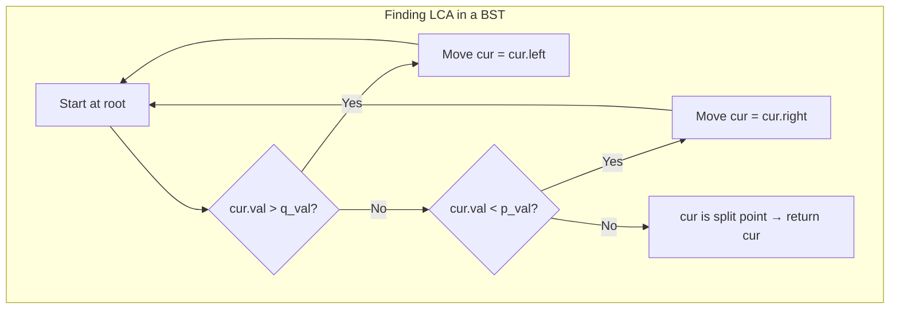

## Data Structures

**`root`**  
- A reference to the root node of the BST.

**`p`, `q`**  
- References to the two target nodes whose lowest common ancestor we seek.
- Each has a unique integer value accessible via `p.val`, `q.val`.

**`p_val`, `q_val`**  
- Integer shortcuts for `p.val` and `q.val`.  
- We’ll reorder them so that `p_val ≤ q_val`, simplifying our comparisons.

**`cur`**  
- A moving reference as we traverse the tree, starting at `root`.

## What happens in `lowestCommonAncestor()`?



I. **Normalize order**  

Ensure `p_val ≤ q_val`, so we need only two directional checks per node.

```python
if p.val > q.val:
    p, q = q, p
p_val, q_val = p.val, q.val
```

II. **Iterative traversal**  

Loop until we find the split point:

1. **Left subtree:**  
   ```python
   if cur.val > q_val:
       cur = cur.left
       continue
   ```
   Both targets lie in the left subtree.

2. **Right subtree:**  
   ```python
   if cur.val < p_val:
       cur = cur.right
       continue
   ```
   Both targets lie in the right subtree.

3. **Split point (LCA):**  
   ```python
   # p_val ≤ cur.val ≤ q_val
   return cur
   ```
   One target is not on the same side as the other (or equals `cur`), so `cur` is their lowest common ancestor.

```python
cur = root
while cur:
    if cur.val > q_val:
        cur = cur.left
    elif cur.val < p_val:
        cur = cur.right
    else:
        return cur
```

## Complexity

- **Time:**  
  $O(h)$, where $h$ is the height of the tree (on average $O(\log n)$ for balanced BSTs, worst-case $O(n)$).

- **Space:**  
  $O(1)$ extra for the iterative approach (or $O(h)$ call-stack if you opt for a recursive variant).
