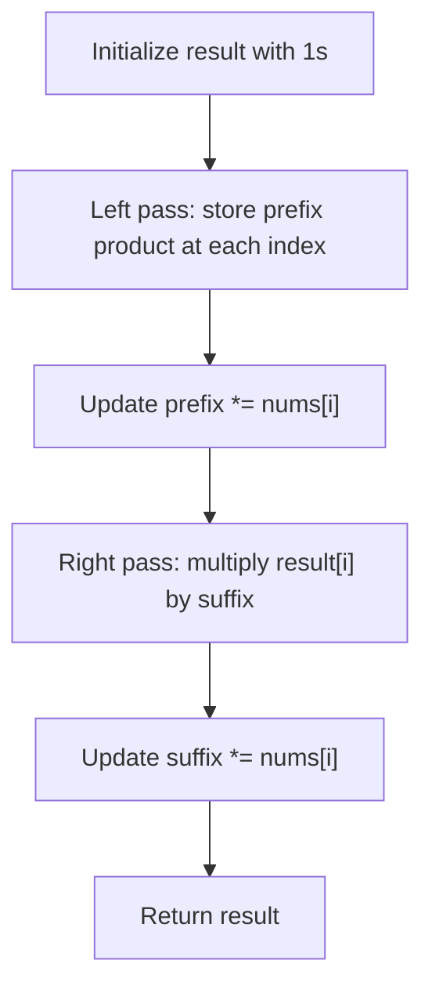

## Data Structures

* **`nums`**: the input list of integers.
* **`result`**: the output array storing the product of all elements except `nums[i]`.
* **`prefix`**: running product of elements to the left of the current index.
* **`suffix`**: running product of elements to the right of the current index.

## Overall Approach

The solution avoids division by building the answer in two passes:

1. A left-to-right pass stores the product of all elements before each index.
2. A right-to-left pass multiplies in the product of all elements after each index.



This produces the correct answer for every index without using extra prefix and suffix arrays.

## Complexity Analysis

* **Time Complexity**: `O(n)`, because the array is traversed twice.
* **Space Complexity**: `O(1)` extra space if the output array is not counted.

## Key Insights

* `result[i]` first stores the product of all values to the left of `i`.
* The second pass injects the product of all values to the right of `i`.
* This handles zeros naturally without special-case division logic.

## Source Code Analysis

```python
from typing import List

class Solution:
    def productExceptSelf(self, nums: List[int]) -> List[int]:
        n = len(nums)
        result = [1] * n

        # prefix products
        prefix = 1
        for i in range(n):
            result[i] = prefix
            prefix *= nums[i]

        # suffix products
        suffix = 1
        for i in range(n - 1, -1, -1):
            result[i] *= suffix
            suffix *= nums[i]

        return result
```

## Related Problems

* Trapping Rain Water
* Maximum Product Subarray
* Subarray Product Less Than K
