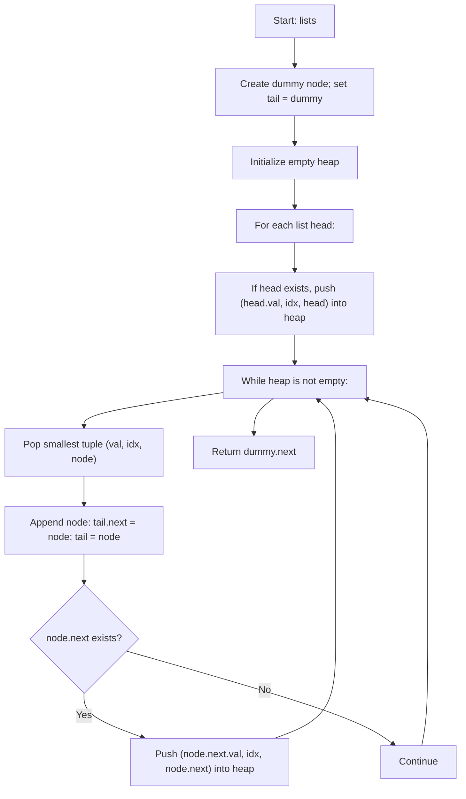

## Data Structures

**`lists`**

* A list of pointers, each pointing to the head of a sorted linked list (or **None**).

**`ListNode`**

* A node in a singly-linked list with attributes:

  * **val**: integer stored in the node
  * **next**: reference to the next node (or **None**)

**`dummy`**

* A new `ListNode` used as a placeholder before the head of the merged result.

**`tail`**

* Pointer to the last node in the merged list under construction; starts at **dummy**.

**`heap`**

* A min-heap (priority queue) storing tuples of the form

  ```
  (node_val, list_index, node_pointer)
  ```

  * **node\_val**: the value at the current node (for ordering)
  * **list\_index**: the index of the originating list (to break ties)
  * **node\_pointer**: reference to the current `ListNode`

---

## What happens in mergeKLists()



1. **Initialize dummy and heap**

   ```python
   dummy = ListNode()
   tail = dummy
   heap = []
   ```

2. **Build the initial heap**

   ```python
   for i, head in enumerate(lists):
       if head:
           heapq.heappush(heap, (head.val, i, head))
   ```

   * For each non-empty input list, push its head node into the heap, keyed by node value so the smallest appears first. Ties break by list index.

3. **Merge by repeatedly extracting the minimum**

   ```python
   while heap:
       val, i, node = heapq.heappop(heap)
       tail.next = node
       tail = tail.next
       if node.next:
           heapq.heappush(heap, (node.next.val, i, node.next))
   ```

   * Pop the tuple with the smallest `node.val` from the heap.
   * Attach that node to the merged list (`tail.next = node`) and advance **tail**.
   * If the extracted node has a successor, push the successor into the heap so its value will be considered in the next iterations.

4. **Return the merged list head**

   ```python
   return dummy.next
   ```

   * `dummy.next` points to the head of the fully merged, sorted list.

---

## Complexity

* **Time:** O(N log k)

  * N = total number of nodes across all k lists.
  * Each node is pushed and popped exactly once from a heap of size at most k, costing O(log k) per operation.

* **Space:** O(k)

  * The heap holds at most one node from each list at any time.
