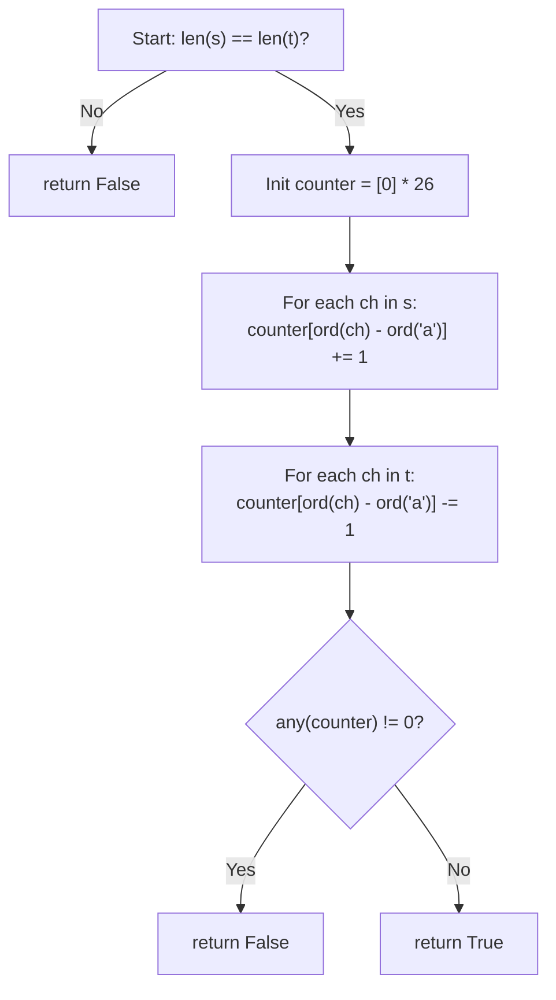

## Data Structures

**Inputs:**

* **`s: str`** — first input string.
* **`t: str`** — second input string to compare against `s`.

**Auxiliary Variables:**

* **`n: int`** — size of the lowercase alphabet, i.e. $\text{ord}(\texttt{'z'}) - \text{ord}(\texttt{'a'}) + 1 = 26$.
* **`counter: List[int]`** — frequency-difference array of length 26, where `counter[i]` tracks the net count of the character with ordinal offset $i$ from `'a'`.
* Positive → character appears more in `s` than `t`.
* Negative → character appears more in `t` than `s`.
* Zero → character counts match.

## Overall Approach

Two strings are anagrams if and only if they contain the same characters with the same frequencies. Instead of maintaining two separate frequency maps, we use a **single counter array** and increment for characters in `s` and decrement for characters in `t`. If every entry is zero at the end, the strings are anagrams.

1. **Early exit:** if the lengths differ, return `False` immediately — anagrams must have equal length.
2. **Count:** walk through `s` and increment the corresponding slot; walk through `t` and decrement.
3. **Verify:** check that no slot is non-zero via `not any(counter)`.



## Step-by-Step Walkthrough

1. **Length check**

   ```python
   if len(s) != len(t):
       return False
   ```

   If the strings have different lengths they cannot be rearrangements of each other.

2. **Allocate the counter array**

   ```python
   n = ord('z') - ord('a') + 1   # 26
   counter = [0] * n
   ```

   One slot per lowercase letter, all initialized to zero.

3. **Increment counts for `s`**

   ```python
   for ch in s:
       counter[ord(ch) - ord('a')] += 1
   ```

   After this loop, `counter[i]` equals the frequency of the $i$-th letter in `s`.

4. **Decrement counts for `t`**

   ```python
   for ch in t:
       counter[ord(ch) - ord('a')] -= 1
   ```

   Each character in `t` cancels one occurrence from `s`. If the strings are anagrams, every slot returns to zero.

5. **Final verification**

   ```python
   return not any(counter)
   ```

   `any(counter)` is `True` when at least one element is non-zero (i.e., a mismatch exists). Negating gives `True` only when all counts are zero — the anagram condition.

## Complexity Analysis

* **Time:** $O(n)$ where $n = \text{len}(s)$.
  We make two linear passes (one over `s`, one over `t`) and a final pass over the 26-element counter. All operations are $O(1)$ per character.

* **Space:** $O(1)$.
  The counter array has a fixed size of 26, independent of input length.
