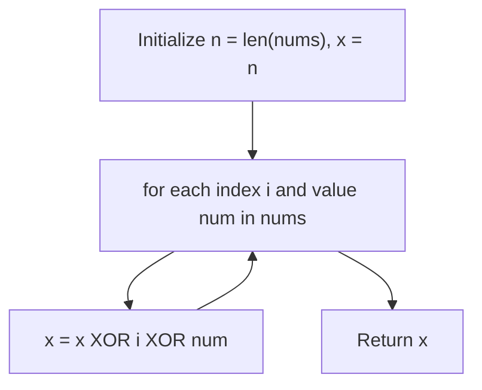

## Data Structures

**`nums`**

* List of integers containing all distinct numbers in the range $[0, n]$ with exactly one missing.

**`n`**

* Integer equal to `len(nums)`, representing the count of numbers present (which is one less than the full range length).

## Two Approaches in `missingNumber()`

The method offers two interchangeable options:

1. **Arithmetic sequence sum**
2. **Bitwise XOR**

### Option 1: Arithmetic Sequence Sum

```python
n = len(nums)
sum_nums = sum(nums)
s_n = n * (n + 1) // 2
return s_n - sum_nums
```

1. **Compute expected sum**

   $$
     s_n = 0 + 1 + 2 + \dots + n = \frac{n(n+1)}{2}
   $$
2. **Compute actual sum**

   $$
     \text{sum\_nums} = \sum_{\text{each }x\in nums} x
   $$
3. **Missing number**

   $$
     \text{missing} = s_n - \text{sum\_nums}
   $$
4. **Return** the result.

### Option 2: Bitwise XOR

```python
n = len(nums)
x = n
for i, num in enumerate(nums):
    x ^= i ^ num
return x
```



1. **Initialization**

   ```python
   x = n
   ```

   * Start with `x` holding the value `n`.

2. **Iterate and XOR**
   For each pair `(i, num)`:

   * XOR in the index `i`.
   * XOR in the array value `num`.
   * Because $a \oplus a = 0$ and $0 \oplus b = b$, every index and its matching number cancel out, leaving only the missing number.

3. **Return**

   * After processing all entries, `x` equals the one number in $[0, n]$ that never got cancelled.

## Complexity

* **Time:**

  * **Option 1:**

    * Summing array: O(n)
    * Constant-time arithmetic: O(1)
    * **Total:** O(n)
  * **Option 2:**

    * Single pass with XOR per element: O(n)
    * **Total:** O(n)

* **Space:**

  * **Both options:** O(1) extra space (only a few integer variables).
