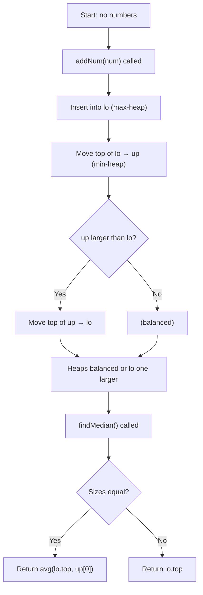

## Data Structures

**`MaxHeap`**

* Wraps Python’s `heapq` to behave as a max‑heap by storing negated values.

  * **\_data**: list of negated numbers.
  * **push(num)**: push `-num`.
  * **pop()**: pop and return `-heapq.heappop(_data)`.
  * **top()**: peek `-_data[0]`.
  * ****len**()**: number of elements.

**`MedianFinder`**

* Maintains two heaps to track the lower and upper halves of the data stream:

  * **lo** (`MaxHeap`): max‑heap for the smaller half.
  * **up** (min‑heap via `heapq`): min‑heap for the larger half.

---

## What happens in `MedianFinder`



1. **Adding a number (`addNum`)**

   ```python
   lo.push(num)
   val = lo.pop()
   heapq.heappush(up, val)
   if len(up) > len(lo):
       val = heapq.heappop(up)
       lo.push(val)
   ```

   * **Step 1:** Push into max‑heap **lo**.
   * **Step 2:** Pop its maximum (`val`) and push into min‑heap **up**—this ensures every element in **lo** ≤ every element in **up**.
   * **Step 3:** If **up** now has more elements than **lo**, rebalance by moving **up**’s smallest back into **lo**.
   * **Invariant:** either `len(lo) == len(up)` or `len(lo) == len(up) + 1`.

2. **Finding the median (`findMedian`)**

   ```python
   if len(up) == len(lo):
       return (lo.top() + up[0]) / 2
   else:
       return lo.top()
   ```

   * **Even total count:** median is the average of the two middle values (`lo.top()` is the max of the lower half; `up[0]` is the min of the upper half).
   * **Odd total count:** extra element lives in **lo**, so median is `lo.top()`.

---

## Complexity

* **addNum:** O(log n) per insertion (heap push/pop).
* **findMedian:** O(1) time.
* **Space:** O(n) to store all numbers across both heaps.
