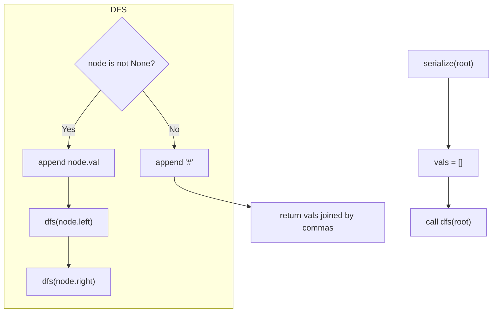
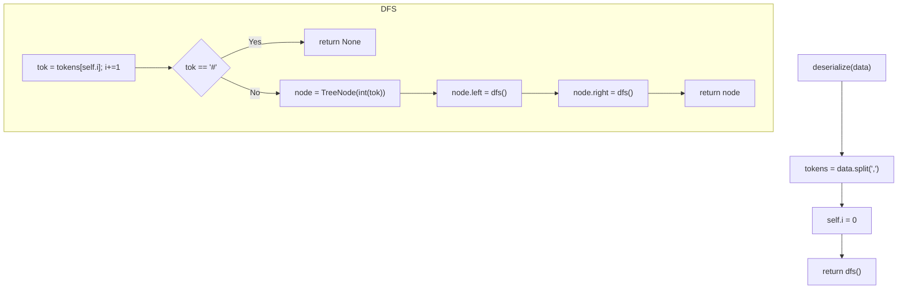

## Data Structures

**`root`**  
- The root of the input binary tree to be serialized.

**`vals`**  
- A list of string tokens built during DFS preorder: either a node’s value or `'#'` for null.

**`data`**  
- The serialized string, tokens joined by commas.

**`tokens`**  
- The list obtained by splitting `data` on commas during deserialization.

**`self.i`**  
- An integer index into `tokens`, advanced as we rebuild nodes in preorder.

## What happens in `serialize()`?

1. **DFS Preorder**  
   - Visit node → append its value.  
   - Recurse left → recurse right.  
   - At each `None`, append `'#'` to mark nulls.
2. **Join**  
   - Return `','.join(vals)`, e.g. `"1,2,#,#,3,4,#,#,5,#,#"`.

## What happens in `deserialize()`?

1. **Tokenize**  
   - Split the string into a queue of values and null markers.
2. **Rebuild with DFS**  
   - Read one token at a time (`self.i`), creating a new `TreeNode` for numbers or returning `None` for `'#'`.
   - Recursively assign `left` then `right`.
3. **Return**  
   - The reconstructed tree’s root.

## Complexity

- **Time:** $O(N)$ for both methods, where $N$ is the number of nodes.  
  - Each node and null marker is visited exactly once in serialize and once in deserialize.
- **Space:** $O(N)$ extra.  
  - The `vals` (and resulting string) size is $2N+1$ tokens worst‐case.  
  - The recursion stack can go $O(N)$ deep in a skewed tree.
 
