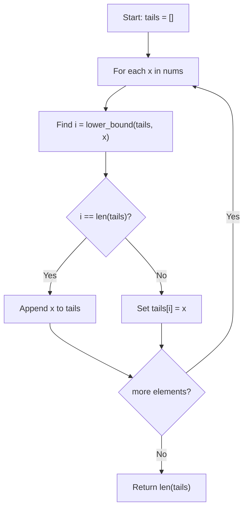

## Data Structures

**Inputs:**

* `nums`: sequence of integers of length $n$.

**Auxiliary Variables:**

* **`tails`**: dynamic array where `tails[k]` holds the minimum possible tail value of any strictly increasing subsequence of length $k+1$.
* **`i`**: position found by binary search within `tails`.

## Overall Approach

We seek the length of the longest strictly increasing subsequence (LIS) by maintaining only the necessary “tail” values, rather than all subsequences.  Concretely:

1. **Invariant**: after processing the first $j$ elements, `tails` is strictly increasing, and its length equals the LIS within those $j$ elements.
2. **Update Rule**: for each new element $x$, find the first index $i$ in `tails` with `tails[i] ≥ x` (binary search).

   * If no such index exists, **append** $x$ (increasing the LIS length).
   * Otherwise **replace** `tails[i]` with $x$, improving the potential for longer subsequences later.

* **lower\_bound** is a binary search in $O(\log n)$ time.

## Complexity Analysis

* **Time Complexity:**
  Each of the $n$ iterations performs a binary search on `tails` of size at most $n$, for $O(n\log n)$ overall.
* **Space Complexity:**
  $O(n)$ to store the `tails` array in the worst case.
